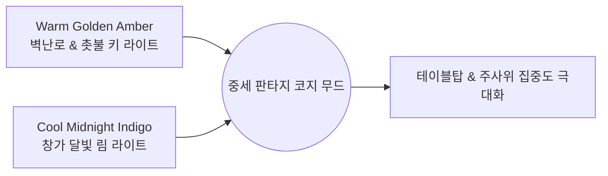

# Cozy Fantasy Hearth & Tabletop Art Style Guide

본 문서는 게임의 전체적인 비주얼 톤앤매너, 테이블 및 러너 디자인, 조명 설정을 차후 다른 AI 모델 및 작업자에게 일관되게 인수인계하기 위한 공식 아트 가이드입니다.

---

## 1. 핵심 분위기 & 라이팅 (Atmosphere & Lighting)

- **전체 무드**: 아늑하고 따뜻한 중세 판타지 학자의 서재 / 벽난로 선술집 (Cozy Fantasy Study & Hearth).
- **시그니처 조명 보색 대비 (Warm vs Cool Contrast)**:
  - **Key Light (주광)**: 벽난로와 촛불에서 방출되는 풍부하고 따뜻한 **골든 앰버 / 웜 오렌지 (`#ff9e3b`, 2800K~3000K, 강도 1.4~1.6)**.
  - **Rim / Fill Light (보조광)**: 창문을 통해 은은하게 스며드는 **쿨 미드나이트 인디고 / 블루 (`#364b6e`, 강도 0.35~0.5)**로 테이블 외곽 및 모서리에 고급스러운 보색 림 라이트 형성.
  - **Shadows (그림자)**: 붉은 기 없이 자연스럽게 가라앉는 **딥 에보니 브라운 (`#140f0c`)**.

---

## 2. 테이블 디자인 (Tabletop Specification)

- **형태 (Geometry)**: 날카롭거나 얇은 면을 배제하고, 두께감 있고 모서리가 둥글려진 **두툼한 챔퍼(Chunky Beveled Edges)** 형태.
- **색감 (Wood Tone)**: 촛불과 모닥불 빛을 머금은 부드럽고 따뜻한 **웜 허니 브라운 / 토피 월넛 (`#633e26` ~ `#7d4d2e`)**.
- **표면 질감 (Texture & Shading)**:
  - 자잘한 실사 사진 노이즈를 배제한 **굵직하고 부드러운 스타일라이즈드 핸드페인티드 나뭇결**.
  - `Smoothness: 0.18 ~ 0.22` (자연스러운 무광 원목 질감), `Metallic: 0.0`.

---

## 3. 러너 디자인 (Runner & Accent Trim)

- **원단 베이스 (Fabric Body)**:
  - 차가운 원색 빨강이 아닌, 따뜻하고 묵직한 **딥 크림슨 / 테라코타 버건디 (`#7c2b20` ~ `#8e3326`)**.
  - `Smoothness: 0.12 ~ 0.15` (매트한 두터운 직물감), `Metallic: 0.0`.
- **골드 패턴 액센트 (Gold Trim & Pattern)**:
  - 러너 중앙 및 테두리에 **골든 옐로우 / 앤틱 머스터드 골드 (`#e5a93c` ~ `#f2b749`)** 톤의 **기하학적 켈틱 놋워크(Celtic Knotwork) / 노르딕 패턴** 적용.
  - `Smoothness: 0.70 ~ 0.80`, `Metallic: 0.85 ~ 0.90` (은은하게 빛을 반사하는 메탈릭 골드).

> **Cel 모드 단서 (M10.8).** 위 `Smoothness`/`Metallic` 값은 `RenderStyle.Baseline` 기준이다.
> `RenderStyle.Cel`에서는 스페큘러와 환경 반사를 쓰지 않으므로 두 값이 화면에 나타나지 않는다.
> Cel에서 재질을 구분하는 것은 §4 명도 램프의 **밴드 수**다. 확산 재질은 3단, 금속으로 읽히길
> 원하는 재질(금색 트림 등)은 4단을 준다. 밴드 수는 별도 필드가 아니라 기존 `Metallic > 0.5`에서
> 파생시키므로, 위 값은 Cel 모드에서도 계속 의미를 갖는다. 자세한 내용은
> [`docs/cel_shading_pixel_plan.md`](cel_shading_pixel_plan.md) 3절에 있다.

---

## 4. 디자인 시스템 컬러 팔레트 (Design Tokens)

| 토큰 명칭 | Hex Code | RGB (0~255) | 적용 대상 및 역할 |
| :--- | :--- | :--- | :--- |
| `color-light-warm-key` | `#ff9e3b` | `(255, 158, 59)` | 메인 촛불/벽난로 웜 앰버 조명 |
| `color-light-cool-rim` | `#364b6e` | `(54, 75, 110)` | 창가 달빛 쿨 인디고 림/필 라이트 |
| `color-table-wood-main` | `#6e432a` | `(110, 67, 42)` | 메인 원목 판자 테이블 색상 |
| `color-table-wood-tint` | `#825033` | `(130, 80, 51)` | 하이라이트/톤 변화 판자 색상 |
| `color-runner-crimson` | `#882d22` | `(136, 45, 34)` | 러너 패브릭 딥 크림슨 본체 |
| `color-runner-gold` | `#e5a93c` | `(229, 169, 60)` | 러너 골드 켈틱 트림/패턴 |
| `color-shadow-underlay` | `#140f0c` | `(20, 15, 12)` | 테이블 틈새 및 깊은 음영 언더레이어 |
| `color-scene-background` | `#0f0c10` | `(15, 12, 16)` | 카메라 기본 배경색 (딥 챠콜) |

---

## 5. AI 모델 인수인계 지침 (AI Instructions)

차후 본 프로젝트의 비주얼, 씬 구성, 셰이더, UI를 작업하는 모든 AI는 다음 규칙을 준수해야 합니다:

1. **포토릴리스틱 노이즈 금지**: 실사 텍스처 노이즈나 복잡한 사인파 굴곡을 사용하지 말고, 단정하고 스타일라이즈드된 면과 색감으로 구현할 것.
2. **조명 보색 유지**: 단일 백색 조명 대신 반드시 **웜 앰버(Key) + 쿨 블루(Rim)**의 2중 조명 밸런스를 유지할 것.
3. **일관된 컬러 토큰 사용**: 테이블과 러너 작업 시 본 문서의 4번 팔레트 토큰을 기본값으로 참조할 것.
