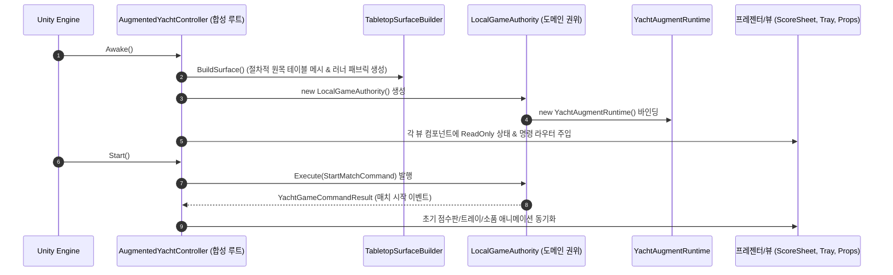
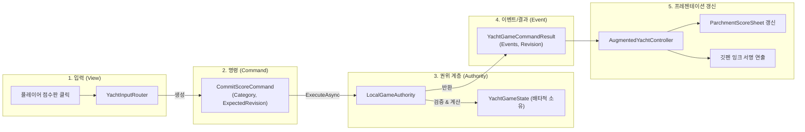
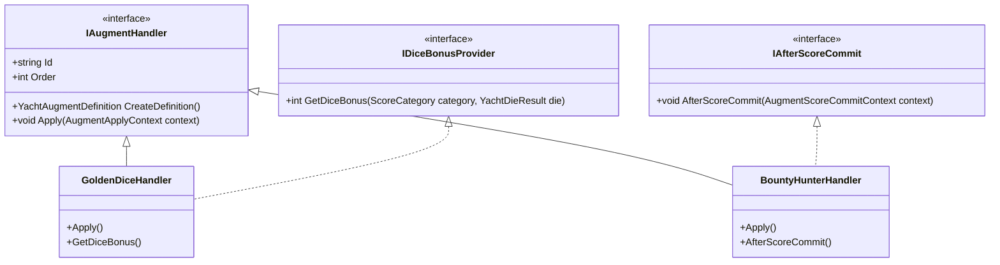

# Tessera 신입 개발자를 위한 프로젝트 구조 및 아키텍처 온보딩 가이드

본 문서는 **Tessera(테세라)** 프로젝트에 처음 합류한 개발자가 코드베이스의 구조, 설계 철학, 데이터 흐름 및 협업 방식을 빠르고 정확하게 이해하고 학습할 수 있도록 작성된 종합 온보딩 가이드입니다.

---

## 목차 (Table of Contents)

1. [프로젝트 개요 및 비전](#1-프로젝트-개요-및-비전)
2. [도메인 용어 사전 (Glossary)](#2-도메인-용어-사전-glossary)
3. [디렉터리 구조 및 모듈 아키텍처](#3-디렉터리-구조-및-모듈-아키텍처)
4. [씬(Scene) 계층 구조 및 런타임 수명 주기](#4-씬scene-계층-구조-및-런타임-수명-주기)
5. [핵심 설계 패턴 및 단방향 데이터 흐름](#5-핵심-설계-패턴-및-단방향-데이터-흐름)
6. [핵심 서브시스템 심층 분석](#6-핵심-서브시스템-심층-분석)
7. [자체 절차적 에셋 생성 파이프라인 (Procedural Generator)](#7-자체-절차적-에셋-생성-파이프라인-procedural-generator)
8. [화면 요소 - 스크립트 1:1 매핑 치트시트](#8-화면-요소---스크립트-11-매핑-치트시트)
9. [자주 발생하는 함정 (Common Pitfalls) 5선](#9-자주-발생하는-함정-common-pitfalls-5선)
10. [신입사원 실무 레시피 (How-to)](#10-신입사원-실무-레시피-how-to)
11. [코딩 규약, 마일스톤 커밋 & AI 협업 체계](#11-코딩-규약-마일스톤-커밋--ai-협업-체계)

---

## 1. 프로젝트 개요 및 비전

### 1.1 게임 콘셉트: "Cozy Fantasy Hearth & Tabletop"
Tessera는 **벽난로 불꽃과 촛불이 은은하게 타오르는 중세 판타지 여관/서재 원목 테이블 위에서 즐기는 3D 스타일라이즈드 주사위 보드게임 플랫폼**입니다.
- **주요 게임 1 (현재 구현)**: **증강 요트 다이스 (Augmented Yacht Dice)**
  - 고전 요트 다이스(Yacht Dice)의 족보 규칙에 **55종 이상의 고유 특수 능력(증강 / Augments)** 카드를 결합한 2인 대전 전략 보드게임 (현재 로컬 2인 핫시트 지원).
- **주요 게임 2 (로드맵 예정)**: **다이스 어드벤처 (Dice Adventure)**
  - 주사위 덱빌딩 로그라이트 싱글 플레이 모드.

### 1.2 핵심 기술 스택
- **엔진**: Unity `6000.3.22f1 (Unity 6)`
- **렌더 파이프라인**: Universal Render Pipeline (URP)
  - 커스텀 렌더러 피처를 통한 픽셀 엣지 필터링 및 스타일라이즈드 셀 셰이딩 지원.
- **언어 및 런타임**: C# (.NET Standard / Unity Mono), Microsoft C# 규약 기반.
- **테스트 환경**: NUnit 기반 Unity EditMode 단위 테스트 프레임워크 (80개 이상의 테스트로 핵심 규칙 및 회귀 방어).
- **에셋 관리**: Git LFS (텍스처, 오디오, 폰트 등 바이너리 추적).

---

## 2. 도메인 용어 사전 (Glossary)

코드베이스 전반에서 사용되는 기획 및 시스템 핵심 용어입니다.

### 2.1 주사위 보드게임 규칙 용어
| 용어 | 영문 식별자 | 설명 |
|---|---|---|
| **주사위 킵** | `Keep` / `DiceKeepTarget` | 굴린 주사위 중 다음 재굴림에서 제외하고 잠가두는 주사위. |
| **재굴림** | `Reroll` / `RollBudget` | 턴마다 기본 2회 제공되는 추가 주사위 굴림 기회. |
| **족보/카테고리** | `ScoreCategory` | 점수판에 기록 가능한 12개 영역. 상단 6개(Aces~Sixes)와 하단 6개(Choice, 4 of a Kind, Full House, S.Straight, L.Straight, Yacht). |
| **상단 보너스** | `Bonus` (35점) | 상단 6개 카테고리 점수 합계가 63점 이상일 때 부여되는 고정 추가 점수. |
| **드래프트** | `Draft` / `DraftRound` | 게임 중간 라운드(예: 3, 6, 9 라운드 등)에 플레이어가 3장의 증강 카드 중 하나를 선택하는 단계. |

### 2.2 증강(Augments) 4대 카테고리
증강은 플레이어의 플레이 방식을 바꾸는 특수 능력 카드로, 4개 도메인으로 분류됩니다:
1. **Core (기본/규칙 변형)**: 게임의 물리적/수학적 기본 규칙을 변경 (예: 주사위 4개 플레이, 주사위 6개 플레이, 킵 불가 규칙 등).
2. **Enhance (강화)**: 특정 족보 점수를 뻥튀기하거나 추가 득점 조건 부여 (예: 풀하우스 완료 시 +15점, 짝수 주사위 득점 증가 등).
3. **Modification (변형 주사위)**: 일반 6면체 주사위 중 하나를 특수 주사위로 변형 (예: 8면체 옥타헤드론 주사위, 황금 주사위, 세븐 주사위 등). 주사위 텍스처와 우표 스티커로 시각화됨.
4. **Quest (퀘스트/과제)**: 특정 턴 안에 까다로운 조건을 완수하면 강력한 보상을 지급하는 목표형 증강.

### 2.3 시스템 및 엔진 아키텍처 용어
- **권위 (Authority / `IGameAuthority`)**: 게임의 논리 상태(`YachtGameState`)와 점수 유효성을 배타적으로 보증하는 주체. 로컬에서는 `LocalGameAuthority`가 담당.
- **베이킹 (Baking / `BakedDiceController`)**: 물리 충돌을 실시간으로 계산하지 않고, 미리 결정론적으로 시뮬레이션해 둔 주사위 낙하/회전 궤적 데이터 클립.
- **합성 루트 (Composition Root)**: 씬에서 오브젝트 간의 의존성을 조립하고 단방향 데이터 흐름을 시작시키는 진입 지점 ([AugmentedYachtController](../../Assets/Scripts/Games/AugmentedYacht/Presentation/AugmentedYachtController.cs)).

---

## 3. 디렉터리 구조 및 모듈 아키텍처

Tessera는 도메인 주도(Domain-Driven) 원칙에 따라 독립성이 보장된 모듈 계층으로 분리되어 있습니다.

```
Assets/Scripts/
├── Core/                   # 공통 기반 메트릭 및 시스템 인프라 (Tessera.Core)
├── Dice/                   # 주사위 물리/베이킹/팩토리/카탈로그 (Tessera.Dice)
├── Tabletop/               # 테이블탑 3D 소품 및 절차적 기하학 (Tessera.Tabletop)
├── Rendering/              # URP 커스텀 패스 및 셰이더/머티리얼 (Tessera.Rendering)
├── Games/                  # 게임 모드 도메인
│   ├── Yacht/              # 순수 요트 다이스 권위/명령/코어 룰 (Tessera.Games.Yacht)
│   └── AugmentedYacht/     # 증강 요트 다이스 전용 시스템 (Tessera.Games.AugmentedYacht)
│       ├── Logic/          # 증강 런타임, 점수 엔진, 55종 증강 핸들러
│       └── Presentation/   # 점수판, UI 뷰, 턴 연출, 카메라/조명 리그, 컨트롤러
└── Network/                # 온라인 멀티플레이어 통신 계층 (Tessera.Network, 로드맵 예정)
```

### 모듈별 상세 역할

#### 1) `Tessera.Core`
- [DiceBoardMetrics.cs](../../Assets/Scripts/Core/DiceBoardMetrics.cs): 주사위 트레이, 굴림 영역, 카메라 시야의 표준 3D 물리 좌표와 오프셋 메트릭 정의.
- [RuntimeAssetGuard.cs](../../Assets/Scripts/Core/RuntimeAssetGuard.cs): 런타임 중 에디터 에셋이 누수되거나 원본이 변조되지 않도록 인스턴스를 보호.
- [TesseraLayers.cs](../../Assets/Scripts/Core/TesseraLayers.cs): 레이캐스트 및 렌더링에 사용되는 Unity Layer 상수 중앙화.

#### 2) `Tessera.Dice`
- [BakedDiceController.cs](../../Assets/Scripts/Dice/BakedDiceController.cs): 권위 계층이 전달한 주사위 최종 눈금과 연출 프리셋을 받아 부드럽게 굴림 애니메이션을 재생.
- [DicePresetCatalog.cs](../../Assets/Scripts/Dice/DicePresetCatalog.cs): 사전 베이크된 낙하/회전 애니메이션 클립 저장소.
- [DiceFaceOrientation.cs](../../Assets/Scripts/Dice/DiceFaceOrientation.cs): 주사위의 윗면(Top Face)이 나타내는 숫자를 계산하는 기하학적 오리엔테이션 판정기.
- [DiceMaterialFactory.cs](../../Assets/Scripts/Dice/DiceMaterialFactory.cs) & [DicePaletteCatalog.cs](../../Assets/Scripts/Dice/DicePaletteCatalog.cs): 일반 주사위, 황금 주사위, 흑요석 주사위 등의 머티리얼 인스턴싱 및 캐싱.

#### 3) `Tessera.Tabletop`
테이블 위에서 살아 숨 쉬는 유기적 소품들로 구성됩니다:
- [HourglassTimer.cs](../../Assets/Scripts/Tabletop/HourglassTimer.cs) & [HourglassMeshBuilder.cs](../../Assets/Scripts/Tabletop/HourglassMeshBuilder.cs): 턴 제한시간을 나타내는 3D 모래시계. 절차적 모래 유동 메시 빌드.
- [InkwellAndQuill.cs](../../Assets/Scripts/Tabletop/InkwellAndQuill.cs) & [QuillHoverAnimator.cs](../../Assets/Scripts/Tabletop/QuillHoverAnimator.cs): 점수판을 마우스 오버하거나 점수를 기록할 때 유기적으로 반응하는 잉크통과 마법 깃펜.
- [RunicSlateMatrix.cs](../../Assets/Scripts/Tabletop/RunicSlateMatrix.cs): 고대 룬 문자가 빛나며 게임 상태를 알리는 석판.
- [RollOrb.cs](../../Assets/Scripts/Tabletop/RollOrb.cs) & [RollCosmicCube.cs](../../Assets/Scripts/Tabletop/RollCosmicCube.cs): 주사위 굴리기 버튼 역할을 겸하는 신비로운 테이블탑 인터랙션 구체 및 성운 큐브.

#### 4) `Tessera.Rendering`
- [PixelEdgeRendererFeature.cs](../../Assets/Scripts/Rendering/PixelEdgeRendererFeature.cs): URP 렌더러에 주입되는 후처리 피처. 3D 모델의 깊이(Depth)와 노멀(Normal)을 기반으로 스타일라이즈드 픽셀 외곽선 검출.
- [CelMaterialFactory.cs](../../Assets/Scripts/Rendering/CelMaterialFactory.cs) & [CelStyleSwitcher.cs](../../Assets/Scripts/Rendering/CelStyleSwitcher.cs): 클래식 렌더와 레트로 픽셀아트 렌더 간 실시간 토글 지원.

#### 5) `Tessera.Games.Yacht` & `Tessera.Games.AugmentedYacht`
- **게임의 심장부**: 순수 도메인 로직(`Logic`)과 화면 표현(`Presentation`)이 엄격하게 분리되어 있습니다.

---

## 4. 씬(Scene) 계층 구조 및 런타임 수명 주기

메인 씬 위치: `Assets/Scenes/Augmented Dice.unity`

신입 개발자가 씬을 열었을 때 가장 많이 혼란을 겪는 부분은 **"씬에 배치된 정적 GameObject"**와 **"코드가 런타임에 동적으로 절차적 생성(Procedural Generation)하는 오브젝트"**의 경계입니다.

### 4.1 씬 Hierarchy 구조도
```text
Augmented Dice (Scene)
├── [Lighting & Atmosphere]
│   ├── Directional Light (Warm Amber Key Light, 2900K)
│   ├── Moon Fill Light (Cool Indigo Rim Light)
│   └── Global Volume (URP Post-processing, Bloom, Tonemapping)
├── [Camera Rig]
│   └── Main Camera ([YachtCameraRig.cs])
├── [Tabletop Environment]
│   ├── TableRoot (원목 테이블 앵커)
│   │   └── SurfaceBuilder ([TabletopSurfaceBuilder.cs] -> 런타임에 원목 판자 및 러너 동적 생성)
│   ├── Props
│   │   ├── Hourglass ([HourglassTimer.cs])
│   │   ├── Inkwell_Quill ([InkwellAndQuill.cs])
│   │   ├── RunicSlate ([RunicSlateMatrix.cs])
│   │   ├── RollOrb ([RollOrb.cs])
│   │   └── CandleStand ([CozyCandleStand.cs])
├── [Game Presentation]
│   ├── ParchmentScoreSheet ([ParchmentScoreSheet.cs])
│   ├── DiceVisualPool ([DiceVisualPool.cs] & [BakedDiceController.cs])
│   ├── AugmentCardTray ([AugmentCardTray.cs] & [AugmentTrayPresenter.cs])
│   └── DebugPanel ([YachtDebugPanel.cs])
└── [Game Orchestrator]
    └── AugmentedYachtController ([AugmentedYachtController.cs] - 합성 루트)
```

### 4.2 런타임 초기화 수명 주기 (Lifecycle Sequence)



> [!IMPORTANT]
> **정적 씬 오브젝트 vs 동적 생성 오브젝트**:
> - 테이블의 나무 판자 이음새와 천 러너는 씬 에셋이 아니라, 게임 시작 시 [TabletopSurfaceBuilder.cs](../../Assets/Scripts/Games/AugmentedYacht/Presentation/TabletopSurfaceBuilder.cs)가 프로시저럴(절차적)하게 버텍스를 계산하여 생성합니다.
> - 따라서 테이블 외형을 수정하려면 씬의 Transform이 아니라 빌더 스크립트나 머티리얼 팩토리를 확인해야 합니다.

---

## 5. 핵심 설계 패턴 및 단방향 데이터 흐름

Tessera는 게임 규모 확장과 멀티플레이어 이관을 위해 **철저한 단방향 데이터 흐름**을 강제합니다.

### 5.1 왜 싱글턴을 쓰지 않는가? (ADR-001)
대다수의 Unity 프로젝트가 `GameManager.Instance`와 같은 전역 정적 싱글턴을 남용하지만, Tessera는 [ADR-001 (docs/architecture_decisions.md)](../architecture_decisions.md)에 따라 **게임 상태에 대한 싱글턴 사용을 엄격히 금지**합니다:
1. **권위 서버(Dedicated Server) 이관 대비**: 싱글턴은 프로세스당 게임 1개만 허용합니다. 하지만 멀티플레이어 서버는 한 프로세스에서 수십 개의 매치 룸(`new LocalGameAuthority()`)을 동시에 구동해야 합니다.
2. **테스트 격리 보장**: NUnit EditMode 테스트 80여 개가 병렬/연속 실행될 때 이전 테스트의 상태 오염 없이 완전히 독립된 세션을 생성할 수 있습니다.
3. **단 단일 진실 공급원(SSOT)은 유지**: 상태를 전역으로 풀지 않고 `LocalGameAuthority` 내부의 `YachtGameState` 하나만 유일한 진실로 삼습니다.

### 5.2 단방향 명령 라이프사이클 (Input → Command → Authority → Event → Presenter)



1. **사용자 액션 발생**: 플레이어가 점수판의 "Full House" 칸을 클릭합니다.
2. **명령 캡슐화**: [ParchmentScoreSheet.cs](../../Assets/Scripts/Games/AugmentedYacht/Presentation/ParchmentScoreSheet.cs)가 점수 변수를 직접 수정하지 않고, [YachtInputRouter.cs](../../Assets/Scripts/Games/AugmentedYacht/Presentation/YachtInputRouter.cs)를 통해 `CommitScoreCommand`를 생성합니다.
3. **권위 검증 및 실행**: [LocalGameAuthority.cs](../../Assets/Scripts/Games/Yacht/LocalGameAuthority.cs)가 현재 턴, 주사위 값, 이미 기록된 칸인지 검증하고 `YachtGameState`를 단독 갱신합니다.
4. **결과 브로드캐스트**: 갱신된 내역은 `YachtGameEvent`와 함께 합성 루트([AugmentedYachtController.cs](../../Assets/Scripts/Games/AugmentedYacht/Presentation/AugmentedYachtController.cs))로 리턴됩니다.
5. **뷰 반영**: 점수판 텍스트가 갱신되고, 마법 깃펜([InkwellAndQuill.cs](../../Assets/Scripts/Tabletop/InkwellAndQuill.cs))이 날아와 점수를 서명하는 연출이 실행됩니다.

---

## 6. 핵심 서브시스템 심층 분석

### 6.1 결정론적 주사위 베이킹(Baking) 시스템
- **문제점**: Unity PhysX 물리 엔진으로 주사위를 직접 굴리면 프레임레이트, 부동소수점 오차, 클라이언트 사양에 따라 결과가 비결정론적으로 변합니다. 이는 리플레이 저장이나 네트워크 동기화를 불가능하게 만듭니다.
- **해결책**:
  1. 권위 계층([LocalGameAuthority.cs](../../Assets/Scripts/Games/Yacht/LocalGameAuthority.cs))이 시드 기반 난수로 최종 눈금(예: `[1, 3, 3, 5, 6]`)을 **수학적으로 먼저 확정**합니다.
  2. 사전 베이크 라이브러리([DicePresetCatalog.cs](../../Assets/Scripts/Dice/DicePresetCatalog.cs))에서 해당 눈금 조합으로 자연스럽게 떨어지는 3D 회전/낙하 궤적 애니메이션 클립을 조회합니다.
  3. [BakedDiceController.cs](../../Assets/Scripts/Dice/BakedDiceController.cs)가 클립을 재생하여 100% 결정론적이면서도 물리적으로 완벽한 주사위 굴림을 연출합니다.

### 6.2 55종 증강(Augments) 확장 시스템 (OCP 준수)
모든 증강은 [IAugmentHandler.cs](../../Assets/Scripts/Games/AugmentedYacht/Logic/Augments/Core/IAugmentHandler.cs) 인터페이스를 구현하며, `YachtAugmentRuntime`에 if-else 사다리를 추가하지 않고 독립 클래스로 존재합니다.

> 📖 **55종 증강 전수 목록, 8단계 턴 훅 오케스트레이션 및 점수 계산 파이프라인**에 대한 상세 기술 문서는 [`docs/guides/augments_specification_and_status.md`](augments_specification_and_status.md)를 참고하세요.



- **라이프사이클 훅 분리**:
  - `IDiceBonusProvider`: 특정 주사위(예: 황금 주사위)가 점수에 보너스를 줄 때 호출.
  - `IAfterScoreCommit`: 족보를 채운 직후 후속 효과(예: 보너스 턴, 추가 코인)가 터질 때 호출.
  - `IOnAugmentSelected`: 드래프트에서 카드를 집는 순간 즉시 발동하는 효과.

---

## 7. 자체 절차적 에셋 생성 파이프라인 (Procedural Generator)

Tessera는 외부 툴(Blender, Photoshop) 의존도를 낮추고 일관된 아트 스타일을 유지하기 위해 자체 에디터 제너레이터를 내장하고 있습니다:

| 제너레이터 도구 | 소스 코드 위치 | 생성 에셋 및 산출물 | 실행 메뉴 경로 |
|---|---|---|---|
| **원목 판자 텍스처** | [WoodPlankTextureGenerator.cs](../../Assets/Editor/WoodPlankTextureGenerator.cs) | 원목 테이블 상판 알베도/노멀 텍스처 | `Tessera > Textures > Generate Wood Plank` |
| **양피지 텍스처** | [ParchmentTextureGenerator.cs](../../Assets/Editor/ParchmentTextureGenerator.cs) | 점수판 양피지 섬유질 노이즈 텍스처 | `Tessera > Textures > Generate Parchment` |
| **주사위 궤적 베이커** | [DicePresetBaker.cs](../../Assets/Editor/DicePresetBaker.cs) | 3D 주사위 낙하 물리 시뮬레이션 클립 베이킹 | `Tessera > Dice > Bake Presets` |
| **특수 주사위 메시** | [DiceShapeBaker.cs](../../Assets/Editor/DiceShapeBaker.cs) | 옥타헤드론(8면체) 등 절차적 주사위 메시 | `Tessera > Dice > Bake Shape Assets` |
| **증강 아이콘 갤러리** | [AugmentIconGalleryWindow.cs](../../Assets/Editor/AugmentIconGalleryWindow.cs) | 전체 55종 증강 카드 렌더링 검수 윈도우 | `Tessera > Augments > Icon Gallery` |
| **픽셀 필터 프리뷰** | [PixelFilterPreview.cs](../../Assets/Editor/PixelFilterPreview.cs) | 픽셀 외곽선 검출 셰이더 실시간 조정 창 | `Tessera > Rendering > Pixel Filter Preview` |

---

## 8. 화면 요소 - 스크립트 1:1 매핑 치트시트

화면에 보이는 특정 시각 요소를 수정하고 싶을 때 즉시 열어야 하는 스크립트 매핑 표입니다.

| 화면 요소 (UI & 3D Props) | 씬 내 역할 | 담당 C# 스크립트 |
|---|---|---|
| **양피지 점수판** | 12개 카테고리 득점표, 빗금 처리, 호버 표시 | [ParchmentScoreSheet.cs](../../Assets/Scripts/Games/AugmentedYacht/Presentation/ParchmentScoreSheet.cs) |
| **굴러가는 3D 주사위들** | 주사위 프리셋 애니메이션 재생 및 최종 눈금 정렬 | [BakedDiceController.cs](../../Assets/Scripts/Dice/BakedDiceController.cs) |
| **주사위 고정(Keep) 영역** | 주사위를 클릭해 아래쪽 트레이로 내리는 인터랙션 | [DiceKeepTarget.cs](../../Assets/Scripts/Dice/DiceKeepTarget.cs) |
| **마법 깃펜과 잉크통** | 점수 기입 서명 연출, 호버 제스처 애니메이션 | [InkwellAndQuill.cs](../../Assets/Scripts/Tabletop/InkwellAndQuill.cs), [QuillHoverAnimator.cs](../../Assets/Scripts/Tabletop/QuillHoverAnimator.cs) |
| **모래시계** | 턴 제한시간 표시, 모래 떨어지는 애니메이션 | [HourglassTimer.cs](../../Assets/Scripts/Tabletop/HourglassTimer.cs) |
| **주사위 굴림 오브 (Roll Orb)** | 굴리기 버튼 클릭 시 회전 및 마법 빛 방출 | [RollOrb.cs](../../Assets/Scripts/Tabletop/RollOrb.cs), [RollCosmicCube.cs](../../Assets/Scripts/Tabletop/RollCosmicCube.cs) |
| **증강 카드 트레이 (우측 상단)** | 현재 플레이어가 보유한 증강 카드 3장 표시 | [AugmentCardTray.cs](../../Assets/Scripts/Tabletop/AugmentCardTray.cs), [AugmentTrayPresenter.cs](../../Assets/Scripts/Games/AugmentedYacht/Presentation/AugmentTrayPresenter.cs) |
| **룬 석판** | 턴 진행 상태 및 라운드 표시 룬 문자 발광 | [RunicSlateMatrix.cs](../../Assets/Scripts/Tabletop/RunicSlateMatrix.cs) |
| **인게임 디버그 창** | 주사위 눈 강제 지정, 증강 즉시 주입 치트 창 | [YachtDebugPanel.cs](../../Assets/Scripts/Games/AugmentedYacht/Presentation/YachtDebugPanel.cs) |

---

## 9. 자주 발생하는 함정 (Common Pitfalls) 5선

신입 개발자가 작업할 때 가장 빈번하게 겪는 실수와 예방책입니다.

### 1. `MonoBehaviour`의 `[SerializeField]` 필드명 임의 변경 금지
- **위험**: 필드명을 바꾸면 Unity 씬(`.unity`)이나 프리팹(`.prefab`) 파일에 직렬화된 참조 키가 끊어져 인스펙터 참조가 `None (Missing)`으로 바뀝니다.
- **해결책**: 필드명을 부득이하게 변경해야 한다면 반드시 `[FormerlySerializedAs("구필드명")]` 어트리뷰트를 붙여야 합니다.

### 2. 프레젠테이션/뷰에서 `YachtGameState` 직접 수정 금지
- **위험**: "점수판 스크립트에서 플레이어 점수 프로퍼티에 바로 10을 더하면 편하지 않나?"라고 생각해 직접 대입하면 권위 계층의 동기화가 깨지고, 이벤트가 발생하지 않아 다른 프레젠터가 갱신되지 않습니다.
- **해결책**: 모든 상태 변경은 반드시 [YachtInputRouter.cs](../../Assets/Scripts/Games/AugmentedYacht/Presentation/YachtInputRouter.cs)를 거쳐 Command를 발행해야 합니다.

### 3. 주사위 굴림에 물리 Rigidbody 직접 조작 금지
- **위험**: `rigidbody.AddForce()` 등으로 주사위를 날리면 사양에 따라 착지 결과가 달라져 미리 계산된 권위 결과값과 불일치(Desync)가 발생합니다.
- **해결책**: 주사위 물리 연출은 [BakedDiceController.cs](../../Assets/Scripts/Dice/BakedDiceController.cs)에 클립 재생을 위임해야 합니다.

### 4. 도메인 로직에 Unity 엔진 객체(`GameObject`, `Transform`) 결합 금지
- **위험**: `IYachtRuleSet`이나 `AugmentHandler` 내부에서 `GameObject.Find`나 `Transform`을 참조하면 EditMode NUnit 테스트 실행 시 씬이 없어 NullReferenceException이 발생합니다.
- **해결책**: `Logic/` 하위 코드는 순수 C# POCO(Plain Old CLR Object) 상태를 유지해야 합니다.

### 5. 무분별한 `async`/`await` 도입 지양 (코루틴 우선)
- **위험**: 게임 연출(주사위 굴림 시간, 카메라 이동, 카드 드로우 등)은 Unity의 메인 스레드 프레임 타이밍과 완벽히 동기화되어야 합니다. 멀티스레드 기반 `Task`를 연출에 남용하면 프레임 스킵이나 스레드 충돌이 발생합니다.
- **해결책**: [docs/coding_conventions.md](../coding_conventions.md)에 따라 프레젠테이션 연출은 코루틴(`IEnumerator`)을 유지합니다.

---

## 10. 신입사원 실무 레시피 (How-to)

### 레시피 1: 신규 증강(Augment) 카드 추가하기

1. **핸들러 파일 생성**:
   - 위치: `Assets/Scripts/Games/AugmentedYacht/Logic/Augments/[Category]/`
   - 카테고리(`Core`, `Enhance`, `Modification`, `Quest`)에 맞춰 `[이름]Handler.cs` 생성.
2. **`IAugmentHandler` 구현**:
   ```csharp
   namespace Tessera.Games.AugmentedYacht
   {
       public sealed class LuckySevenHandler : IAugmentHandler, IDiceBonusProvider
       {
           public string Id => "lucky-seven";
           public int Order => 100;

           public YachtAugmentDefinition CreateDefinition()
           {
               return new YachtAugmentDefinition(
                   Id,
                   "행운의 7",
                   "주사위 눈의 합이 7이 포함되면 보너스 점수 +7점을 얻습니다.",
                   AugmentRarity.Rare,
                   AugmentCategory.Enhance
               );
           }

           public void Apply(AugmentApplyContext context) { }

           public int GetDiceBonus(ScoreCategory category, YachtDieResult die)
           {
               return die.Value == 7 ? 7 : 0;
           }
       }
   }
   ```
3. **카탈로그 등록 및 단위 테스트 작성**:
   - `Assets/Editor/YachtEnhanceAugmentTests.cs`에 득점 계산 검증 테스트 메서드 추가.
   - NUnit 테스트 러너에서 테스트 통과 확인.

### 레시피 2: EditMode 단위 테스트 실행 및 회귀 검증

Tessera는 수시로 테스트를 돌려 회귀 버그를 방지합니다.
- **Unity 에디터 내 실행**:
  - 상단 메뉴 `Window > General > Test Runner` 열기.
  - `EditMode` 탭 선택 후 `Run All` 클릭 (모든 테스트가 초록색 체크가 되는지 확인).
- **CLI 커맨드 실행 (배치 모드)**:
  ```powershell
  & "Unity.exe" -runTests -projectPath . -testPlatform EditMode -testResults Logs/editmode-results.xml -batchmode
  ```

---

## 11. 코딩 규약, 마일스톤 커밋 & AI 협업 체계

### 11.1 코딩 규약 핵심 ([docs/coding_conventions.md](../coding_conventions.md))
- **언어**: 모든 코드 주석, 커밋 메시지, 문서는 **한국어**로 작성합니다.
- **Private 필드 명명 규칙**: `_` 접두사를 쓰지 않고 순수 **`camelCase`**를 사용합니다 (예: `private HourglassTimer hourglassTimer;`). Unity 인스펙터 필드명 파손 방지 목적입니다.
- **정밀 수정 (Surgical Changes)**: 내가 담당한 태스크와 무관한 파일의 코드 포맷팅이나 임의 리팩터링을 절대 금지합니다.

### 11.2 커밋 & 브랜치 프로토콜 ([CLAUDE.md](../../CLAUDE.md))
- **커밋 단위는 마일스톤**: 작업 태스크 하나마다 커밋하지 않고, 마일스톤 전체가 검증되었을 때 1회 커밋합니다.
- **메시지 형식**: Conventional Commits + **명사형 종결**
  - 좋은 예: `feat(dice): 옥타헤드론 8면체 주사위 회전 연출 추가`
  - 나쁜 예: `feat(dice): 8면체 주사위를 추가했습니다`, `fix: 버그 수정함`
  - 본문 불릿포인트: `- 무엇을 왜 바꿨는지 명사형으로 기술`

### 11.3 AI 에이전트 및 지식 도구 활용
- **지식 그래프 (graphify)**:
  - 프로젝트 루트의 `graphify-out/`에 전체 코드베이스의 AST 기반 지식 그래프가 빌드되어 있습니다.
  - 새 기능이나 클래스의 호출 관계, 영향 범위를 파악할 때 불필요한 전체 grep 대신 `graphify query` 또는 `GRAPH_REPORT.md`의 God Node 관계도를 먼저 확인합니다.
- **마일스톤 작업 계획서**:
  - [docs/augmented_yacht_work_plan.md](../augmented_yacht_work_plan.md) 및 [docs/solid_refactoring_work_plan.md](../solid_refactoring_work_plan.md)에서 현재 진행 중인 태스크(`DOING`)와 다음 목표(`TODO`)를 추적합니다.

