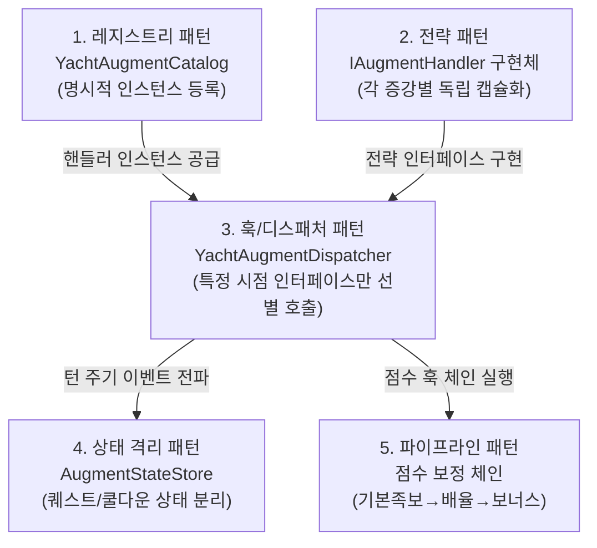
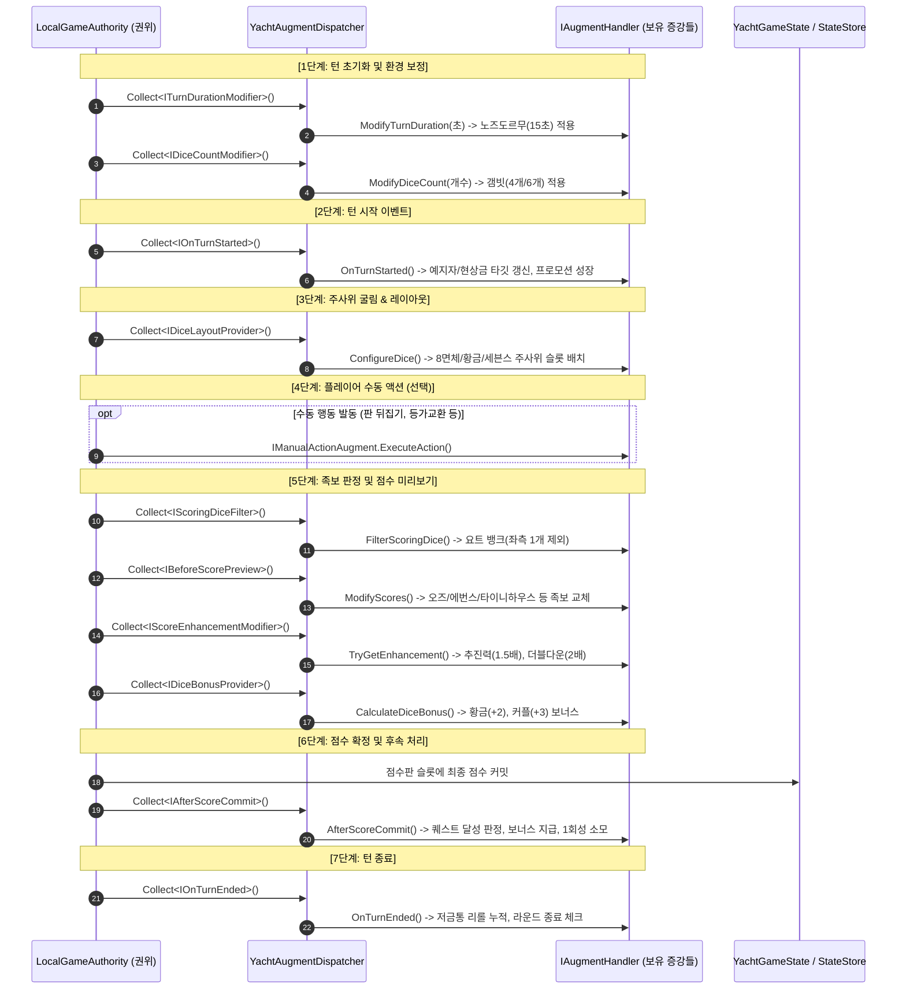

# Tessera 증강(Augments) 시스템 상세 명세 및 구현 현황서

본 문서는 **Tessera(테세라)**의 핵심 게임플레이 메커니즘인 **증강(Augments) 시스템**의 아키텍처 디자인 패턴, 턴 수명주기와의 유기적 오케스트레이션, 점수 계산 파이프라인, 그리고 **55종 전수 구현 현황 및 상세 기술 명세**를 총망라한 개발자 가이드입니다.

---

## 목차 (Table of Contents)

1. [증강 시스템 개요](#1-증강-시스템-개요)
2. [핵심 아키텍처 및 5대 디자인 패턴](#2-핵심-아키텍처-및-5대-디자인-패턴)
3. [턴 생명주기(Turn Lifecycle)와 8단계 훅(Hook) 오케스트레이션](#3-턴-생명주기turn-lifecycle와-8단계-훅hook-오케스트레이션)
4. [점수 계산 파이프라인 및 상호 충돌(Conflict) 해결 규칙](#4-점수-계산-파이프라인-및-상호-충돌conflict-해결-규칙)
5. [증강 55종 전수 구현 현황 및 상세 명세표](#5-증강-55종-전수-구현-현황-및-상세-명세표)
   - [5.1 족보 변형(Modification) 18종 (DONE)](#51-족보-변형modification-18종-done)
   - [5.2 시스템 강화(Enhance) 11종 (DONE)](#52-시스템-강화enhance-11종-done)
   - [5.3 퀘스트/진행형(Quest) 11종 (DONE)](#53-퀘스트진행형quest-11종-done)
   - [5.4 수동 행동(Manual Action) 5종 (DONE)](#54-수동-행동manual-action-5종-done)
   - [5.5 의도적 미구현/보류(HOLD) 4종](#55-의도적-미구현보류hold-4종)
   - [5.6 영구 삭제(CUT) 6종](#56-영구-삭제cut-6종)
6. [런타임 상태 관리 (`AugmentStateStore`) 및 동기화](#6-런타임-상태-관리-augmentstatestore-및-동기화)
7. [검증 체계: 단위 테스트 및 샌드박스 디버그 패널](#7-검증-체계-단위-테스트-및-샌드박스-디버그-패널)

---

## 1. 증강 시스템 개요

**증강(Augments)**은 전통적인 요트 다이스의 족보 완성 규칙에 전략적 변수와 깊이를 부여하는 특수 카드 시스템입니다.
- 플레이어는 게임 중 3번의 드래프트 페이즈(라운드 1, 6, 9)를 거쳐 총 3장의 증강 카드를 획득·장착합니다.
- 증강은 단순히 고정된 수치를 더하는 것에 그치지 않고, **주사위 면의 기하학적 형태 교체(8면체, 황금 주사위)**, **특정 족보 달성 조건의 전면 재정의(소수 판정, 블랙잭, 피보나치)**, **다양한 턴 퀘스트 및 수동 발동 액션(판 뒤집기, 등가교환)** 등 게임의 전방위 룰을 동적으로 변형합니다.
- 따라서 증강 시스템은 단일 스크립트에 하드코딩될 수 없으며, **완전한 확장성(OCP)**과 **엄격한 결정론(Determinism)**을 갖춘 아키텍처로 설계되었습니다.

---

## 2. 핵심 아키텍처 및 5대 디자인 패턴

Tessera의 증강 시스템은 SOLID 원칙을 기반으로 아래의 5대 패턴이 정밀하게 맞물려 구동됩니다.



### 1) 전략 패턴 (Strategy Pattern)
- **핵심 파일**: [IAugmentHandler.cs](../../Assets/Scripts/Games/AugmentedYacht/Logic/Augments/Core/IAugmentHandler.cs)
- 모든 증강은 `IAugmentHandler`를 기본 구현하는 개별 독립 클래스로 작성됩니다.
- 거대한 `switch-case`나 `if-else` 분기 없이, 각 증강이 자신의 정의(`CreateDefinition`), 발동 순서(`Order`), 그리고 고유 알고리즘을 스스로 캡슐화합니다.

### 2) 훅 & 멀티캐스트 디스패처 패턴 (Hook / Multi-cast Dispatcher Pattern)
- **핵심 파일**: [YachtAugmentDispatcher.cs](../../Assets/Scripts/Games/AugmentedYacht/Logic/Augments/Core/YachtAugmentDispatcher.cs)
- 인터페이스 분리 원칙(ISP)에 따라 증강이 개입하는 시점별로 세분화된 인터페이스(`IOnTurnStarted`, `IBeforeScorePreview`, `IAfterScoreCommit` 등)가 존재합니다.
- 디스패처는 현재 플레이어가 보유한 증강 목록 중 **해당 인터페이스를 구현한 핸들러만 선별(`Collect<T>`)**하고, `Order`와 카탈로그 등록 순서를 기준으로 **결정론적(Deterministic) 정렬**을 거쳐 순차 호출합니다.

### 3) 상태 격리 패턴 (Isolated State Pattern)
- **핵심 파일**: [AugmentStateStore.cs](../../Assets/Scripts/Games/AugmentedYacht/Logic/Augments/Core/AugmentStateStore.cs), [IAugmentState.cs](../../Assets/Scripts/Games/AugmentedYacht/Logic/Augments/Core/IAugmentState.cs)
- 증강 중에는 퀘스트 누적 카운트, 스킬 사용 여부, 주사위 성장 단계 등의 가변 상태를 보관해야 하는 경우가 많습니다.
- 이 상태들을 권위 핵심 데이터 구조(`YachtGameState`)에 무분별하게 추가하지 않고, `AugmentStateStore`에 각 증강별 전용 POCO DTO(예: `NoTimeToWasteState`, `PromotionDieState`)로 격리 보관합니다.

### 4) 파이프라인 체인 패턴 (Pipeline Pattern)
- 점수 계산 시 단일 수식으로 끝나지 않고, **기본 족보 평가 → 족보 룰 교체(`IBeforeScorePreview`) → 배율 강화(`IScoreEnhancementModifier`) → 주사위 고정 보너스(`IDiceBonusProvider`)** 순으로 데이터가 단계별 파이프라인을 통과합니다.

### 5) 레지스트리 패턴 (Registry Pattern)
- **핵심 파일**: [YachtAugmentCatalog.cs](../../Assets/Scripts/Games/AugmentedYacht/Logic/Augments/Core/YachtAugmentCatalog.cs)
- 리플렉션(Reflection)을 통한 런타임 검색은 Unity IL2CPP / AOT 빌드 환경에서 코드 스트리핑이나 성능 저하를 유발합니다.
- 따라서 모든 증강 핸들러는 `YachtAugmentCatalog.Handlers` 정적 배열에 명시적으로 등록되어 절대적인 안정성을 보장합니다.

---

## 3. 턴 생명주기(Turn Lifecycle)와 8단계 훅(Hook) 오케스트레이션

턴이 시작되어 주사위를 굴리고 점수를 확정할 때까지, 증강 인터페이스들이 호출되는 시점과 데이터 교환 흐름입니다.



### 시점별 인터페이스 명세표
| 단계 | 호출 인터페이스 | 전달 Context | 주요 담당 증강 예시 |
|---|---|---|---|
| **선택** | `IOnAugmentSelected` | `AugmentSelectionContext` | `random-box`(무작위 교체 및 상단 58 설정) |
| **턴 준비** | `IDiceCountModifier`<br/>`ITurnDurationModifier` | `AugmentQueryContext` | `gambit`(주사위 수 조절)<br/>`nozdormu`(타이머 15초 단축) |
| **턴 시작** | `IOnTurnStarted` | `AugmentTurnContext` | `promotion-die`(눈금+1 성장)<br/>`bounty-hunter`(사냥 타깃 제시) |
| **주사위 구성** | `IDiceLayoutProvider` | `AugmentDiceContext` | `8-sided`(8면체 배치)<br/>`golden-die`(황금 주사위 배치) |
| **수동 발동** | `IManualActionAugment` | `AugmentActionContext` | `table-flip`(무료 재굴림)<br/>`equivalent-exchange`(추가 굴림) |
| **점수 필터** | `IScoringDiceFilter` | `AugmentQueryContext` | `yacht-bank`(왼쪽 주사위 점수 계산 제외) |
| **족보/점수** | `IBeforeScorePreview`<br/>`IScoreEnhancementModifier`<br/>`IDiceBonusProvider` | `AugmentScoreContext`<br/>`AugmentQueryContext` | `evens`, `odds`, `tiny-house`(족보 교체)<br/>`momentum`(1.5배)<br/>`couple-dice`(+3) |
| **점수 확정 후** | `IAfterScoreCommit` | `AugmentCommitContext` | `fast-straight`, `holdout`(퀘스트 보상)<br/>`bounty-hunter`(사냥 성공/실패 정산) |
| **턴 종료** | `IOnTurnEnded` | `AugmentCommitContext` | `piggy-bank`(남은 리롤×3 저금) |

---

## 4. 점수 계산 파이프라인 및 상호 충돌(Conflict) 해결 규칙

### 4.1 점수 계산 4단계 계층 공식

최종 점수는 다음과 같은 계층 순서로 계산됩니다:

$$\text{FinalScore} = \Big(\lfloor \text{BaseScore} \times \text{EnhancementMultiplier} \rfloor \Big) + \text{DiceBonus} + \text{InstantQuestReward}$$

1. **1단계 (기본 족보 평가 및 교체)**:
   - 주사위 눈금을 바탕으로 기본 족보를 계산합니다. 만약 `IBeforeScorePreview` 증강(예: `evens`, `tiny-house`, `mountain`)을 보유하고 조건을 만족하면, 해당 카테고리의 기본 점수가 교체 점수로 치환됩니다.
2. **2단계 (배율 강화 적용)**:
   - `momentum`(추진력: 1.5배), `double-down`(더블 다운: 1.5배/추진력 동시 보유 시 2.0배) 효과를 곱한 뒤 소수점을 버립니다(`floor`).
3. **3단계 (주사위 고정 보너스 합산)**:
   - `golden-die`(+2/개), `couple-dice`(+3) 등의 보너스를 배율 계산이 끝난 결과에 **단순 가산**합니다 (주사위 보너스가 배율로 증폭되는 밸런스 붕괴 방지).
4. **4단계 (퀘스트 및 일시 보상 가산)**:
   - 턴 종료 시점 달성된 퀘스트 보너스를 최종 합산합니다.

> [!CRITICAL]
> **스크래치(0점) 절대 원칙**:
> 1단계의 기본 족보 점수가 `0점`인 경우, 주사위 고정 보너스(황금 주사위 등)가 있더라도 **최종 점수는 무조건 0점(스크래치)**으로 처리됩니다. 보너스 점수만 믿고 엉뚱한 칸에 점수를 넣는 꼼수를 원천 차단합니다.

### 4.2 충돌(Conflict) 및 상호 배제 규칙

1. **동일 카테고리 슬롯 교체 충돌**:
   - `lucky-sevens`와 `perfect-squares`는 둘 다 `Aces` 카테고리를 변형합니다.
   - 플레이어는 동일한 카테고리를 대상으로 하는 족보 변형 카드를 2장 이상 동시에 보유할 수 없습니다 (드래프트 알고리즘에서 상호 배제 필터링).
2. **주사위 형태 및 물리 조작 충돌**:
   - `8-sided`(8면체 주사위)를 보유한 상태에서는 `table-flip`(판 뒤집기)을 선택할 수 없습니다. 8면체 메시 궤적과 판 뒤집기 궤적 프리셋 간의 연출 충돌을 방지합니다.
3. **드래프트 등장 라운드 제한 (기한 만료 방지)**:
   - `fast-straight`(8라운드 내 완료 필요), `step-by-step`(Aces부터 순차 완료 필요) 등은 후반 드래프트에 등장하면 달성이 원천 불가능하므로, 라운드 1 드래프트에서만 등장하도록 제한됩니다.
4. **개인 적용 및 점수판 스티커 원칙**:
   - 2인 대전 시 변형 카드는 **오직 카드를 집은 플레이어에게만 적용**됩니다.
   - 상대방 점수판에는 영향을 주지 않으며, 현재 턴 플레이어의 점수판 위에 **동적 스티커 오버레이** 형태로 변형된 족보명이 표시됩니다.

---

## 5. 증강 55종 전수 구현 현황 및 상세 명세표

> **구현 현황 종합**:
> - **완전 구현 및 검증 완료**: **45종 (DONE)**
> - **의도적 미구현 및 기획 보류**: **4종 (HOLD)** (`four-by-four`, `two-households`, `strange-die`, `coin-toss`)
> - **영구 삭제**: **6종 (CUT)** (3~8번 안티 계열 족보)

---

### 5.1 족보 변형(Modification) 18종 (DONE)
기존 점수판의 12개 카테고리 룰을 다른 조건과 점수 공식으로 전면 치환하는 증강입니다.

| No | ID | 이름 | 대상 카테고리 | 치환 조건 및 효과 | 발동 훅 | C# 구현 클래스 | 상태 |
|:---:|---|---|---|---|---|---|:---:|
| **1** | `lucky-sevens` | 럭키 세븐 | `Aces` | 눈금 합이 7, 17, 27이면 15점 (상단 합산 포함) | `IBeforeScorePreview` | `LuckySevens` | `DONE` |
| **2** | `perfect-squares` | 퍼펙트 스퀘어 | `Aces` | 눈금 합이 9, 16, 25이면 12점 (상단 합산 포함) | `IBeforeScorePreview` | `PerfectSquares` | `DONE` |
| **9** | `gambler` | 갬블러 | `Choice` | 눈금 합이 24 이상이면 합계 + 7점 | `IBeforeScorePreview` | `Gambler` | `DONE` |
| **10** | `three-of-a-kind` | 쓰리 오브 어 카인드 | `FourOfAKind` | 같은 눈 3개 이상이면 모든 주사위 눈금 합계 | `IBeforeScorePreview` | `ThreeOfAKind` | `DONE` |
| **12** | `tiny-house` | 타이니 하우스 | `FullHouse` | 5, 6, 7 없이(1~4로만) 풀하우스 달성 시 28점 | `IBeforeScorePreview` | `TinyHouse` | `DONE` |
| **13** | `two-pair` | 투 페어 | `FullHouse` | 서로 다른 2쌍 또는 4개 이상 동일 눈금 시 15점 | `IBeforeScorePreview` | `TwoPair` | `DONE` |
| **14** | `head-and-tail` | 머리와 몸통 | `FullHouse` | 1페어 + 연속된 3개 눈금 조합 시 합계 + 10점 | `IBeforeScorePreview` | `HeadAndTail` | `DONE` |
| **15** | `evens` | 에번스 | `SmallStraight` | 모든 주사위가 짝수(2, 4, 6)이면 20점 | `IBeforeScorePreview` | `Evens` | `DONE` |
| **16** | `odds` | 오즈 | `SmallStraight` | 모든 주사위가 홀수(1, 3, 5, 7)이면 20점 | `IBeforeScorePreview` | `Odds` | `DONE` |
| **17** | `double-large-straight` | 더블 라지 스트레이트 | `SmallStraight` | 스몰 스트레이트를 라지 스트레이트(30점)로 치환, 상단 보너스 기준을 60으로 완화 | `IBeforeScorePreview`<br/>`IOnAugmentSelected` | `DoubleLargeStraight` | `DONE` |
| **18** | `prime-collection` | 프라임 컬렉션 | `LargeStraight` | 모든 눈이 소수(2,3,5,7)이고 2,3,5가 모두 포함되면 35점 | `IBeforeScorePreview` | `PrimeCollection` | `DONE` |
| **19** | `duplex-house` | 땅콩주택 | `FullHouse` | 차이가 정확히 1인 두 숫자로 풀하우스 달성 시 35점 (예: 222-33) | `IBeforeScorePreview` | `DuplexHouse` | `DONE` |
| **20** | `mountain` | 마운틴 | `LargeStraight` | 정확히 2, 3, 4, 5, 6 조합이면 40점 | `IBeforeScorePreview` | `Mountain` | `DONE` |
| **21** | `high-dice` | 하이 다이스 | `LargeStraight` | 모든 눈이 4, 5, 6, 7이고 합계가 26 이상이면 35점 | `IBeforeScorePreview` | `HighDice` | `DONE` |
| **22** | `2nd-choice` | 두 번째 초이스 | `Yacht` | 요트 칸을 주사위 눈금 합계의 절반(내림)으로 기입 | `IBeforeScorePreview` | `SecondChoice` | `DONE` |
| **23** | `fibonacci-numbers` | 피보나치 넘버즈 | `Yacht` | 정렬된 눈금이 정확히 [1, 1, 2, 3, 5]이면 25점 | `IBeforeScorePreview` | `FibonacciNumbers` | `DONE` |
| **24** | `reverse-choice` | 리버스 초이스 | `Yacht` | 요트 칸을 `30 - 합계`로 기입 (음수 점수 허용 및 총점 차감) | `IBeforeScorePreview` | `ReverseChoice` | `DONE` |
| **26** | `blackjack-21` | 블랙잭 21 | `Yacht` | 주사위 5개의 눈금 합이 정확히 21이면 21점 | `IBeforeScorePreview` | `Blackjack21` | `DONE` |

---

### 5.2 시스템 강화(Enhance) 11종 (DONE)
주사위의 물리 형태를 바꾸거나 보너스 점수 및 추가 혜택을 주는 강화 증강입니다.

| No | ID | 이름 | 유형 | 효과 설명 | 발동 훅 | C# 구현 클래스 | 상태 |
|:---:|---|---|---|---|---|---|:---:|
| **25** | `yacht-bank` | 요트 뱅크 | 점수 저축 | 3턴 동안 점수 확정 시 킵 존 가장 왼쪽 주사위를 제외하고 저축(최대 15점), 이후 턴 시작 시 일시 지급 | `IScoringDiceFilter`<br/>`IOnTurnStarted`<br/>`IAfterScoreCommit` | `YachtBank` | `DONE` |
| **37** | `weighted-dice` | 묵직한 주사위 | 특수 주사위 | 주사위 1개의 면을 [4, 4, 5, 5, 6, 6]으로 영구 교체 | `IDiceLayoutProvider` | `WeightedDice` | `DONE` |
| **38** | `momentum` | 추진력 | 배율 강화 | 첫 족보 0점(스크래치) 발생 시 발동 대기, 다음 턴 양수 기본 족보 점수를 1.5배로 강화 | `IScoreEnhancementModifier`<br/>`IAfterScoreCommit` | `Momentum` | `DONE` |
| **39** | `golden-die` | 황금 주사위 | 특수 주사위 | 황금 주사위 눈이 1, 2, 3이면 각각 +2점 보너스 (상단 합산 포함) | `IDiceLayoutProvider`<br/>`IDiceBonusProvider` | `GoldenDie` | `DONE` |
| **41** | `8-sided` | 8면 주사위 | 특수 주사위 | 주사위 2개를 옥타헤드론 [1, 2, 3, 4, 4, 5, 5, 6] 면으로 교체 | `IDiceLayoutProvider` | `Octahedron` | `DONE` |
| **43** | `promotion-die` | 프로모션 주사위 | 성장 주사위 | 눈 1로 시작해 내 턴마다 눈이 +1 성장, 눈 6 상태로 기입 시 일반 주사위로 복귀 | `IDiceLayoutProvider`<br/>`IOnTurnStarted`<br/>`IAfterScoreCommit` | `PromotionDie` | `DONE` |
| **44** | `couple-dice` | 커플 주사위 | 특수 주사위 | 커플 주사위 2개의 눈이 서로 같으면 점수에 +3점 보너스 | `IDiceLayoutProvider`<br/>`IDiceBonusProvider` | `CoupleDice` | `DONE` |
| **45** | `sevens-dice` | 세븐스 다이스 | 특수 주사위 | 주사위 2개를 [2, 3, 4, 5, 6, 7] 면으로 교체. 7을 족보 정상 숫자로 인정하고 4567, 34567 스트레이트 허용 | `IDiceLayoutProvider`<br/>`IBeforeScorePreview` | `SevensDice` | `DONE` |
| **49** | `duel` | 결투 | 대전 보너스 | 획득 즉시 해당 라운드 양쪽 턴 점수를 비교하여 승리 시 +10점, 동점 시 +5점 지급 | `IAfterScoreCommit` | `Duel` | `DONE` |
| **51** | `random-box` | 랜덤 박스 | 증강 교체 | 드래프트 후 비퀘스트 무작위 증강으로 즉시 교체되며 상단 보너스 기준을 58로 완화 | `IOnAugmentSelected` | `RandomBox` | `DONE` |
| **55** | `piggy-bank` | 저금통 | 자원 보너스 | 턴 종료 시 남은 리롤마다 3점씩 저축, 12점 도달 시 +12점 보너스 지급 후 초기화 | `IOnTurnEnded` | `PiggyBank` | `DONE` |

---

### 5.3 퀘스트/진행형(Quest) 11종 (DONE)
특정 턴 수 내에 조건을 달성하면 큰 보너스를 지급하는 장기 과제 증강입니다.

| No | ID | 이름 | 과제 조건 | 보상 | C# 구현 클래스 | 전용 상태 구조체 | 상태 |
|:---:|---|---|---|:---:|---|---|:---:|
| **27** | `fast-straight` | 재빠른 스트레이트 | 8라운드 이내에 Small 및 Large Straight 모두 기입 | +15점 | `FastStraight` | `FastStraightState` | `DONE` |
| **28** | `no-time-to-waste` | 낭비할 시간 없다 | 연속 3턴 동안 리롤 없이 첫 굴림 후 바로 기입 | +15점 | `NoTimeToWaste` | `NoTimeToWasteState` | `DONE` |
| **29** | `step-by-step` | 차근차근 | Aces부터 Sixes까지 순서대로 상단 기입 완료 | 상단 기준 58 완화 및 보너스 +55점 | `StepByStep` | `StepByStepState` | `DONE` |
| **31** | `holdout` | 알박기 | 9번째 턴 이후에 Full House 기입 | +7점 | `Holdout` | `HoldoutState` | `DONE` |
| **32** | `cautious-straight` | 신중한 스트레이트 | Small Straight 기입 후 Large Straight 순서대로 기입 (역순 시 실패) | +7점 | `CautiousStraight` | `CautiousStraightState` | `DONE` |
| **33** | `every-little` | 티끌 모아 태산 | 득점에 사용한 눈금 '1'을 누적 7개 이상 달성 | +15점 | `EveryLittleCounts` | `EveryLittleState` | `DONE` |
| **34** | `copycat` | 카피캣 | 상대가 기입한 족보를 3회 따라 기입하거나, 하단에서 동일 점수 달성 | +10점 | `Copycat` | `CopycatState` | `DONE` |
| **35** | `doubling` | 더블링 | 스크래치를 제외하고 동일한 점수로 2회 기입 | +10점 | `Doubling` | `DoublingState` | `DONE` |
| **36** | `nozdormu` | 노즈도르무 | 턴 제한시간 15초 페널티를 감수하고 목표 라운드 도달 | +9점 | `Nozdormu` | `NozdormuState` | `DONE` |
| **48** | `bounty-hunter` | 현상금 사냥꾼 | 매 턴 무작위로 지정되는 빈 족보 타깃을 3회 기입 | 최대 15점 (스크래치당 -3점 감산) | `BountyHunter` | `BountyHunterState` | `DONE` |
| **52** | `prophet` | 예지자 | 3턴 동안 제시된 숫자 3개(1~30) 중 하나와 일치하는 점수 기입 | 일치할 때마다 +7점 | `Prophet` | `ProphetState` | `DONE` |

---

### 5.4 수동 행동(Manual Action) 5종 (DONE)
플레이어가 주사위를 굴리는 도중 직접 버튼을 눌러 개입하는 액티브 스킬 증강입니다.

| No | ID | 이름 | 사용 타이밍 | 효과 설명 | C# 구현 클래스 | 상태 |
|:---:|---|---|---|---|---|:---:|
| **46** | `table-flip` | 판 뒤집기 | 첫 굴림 후 (게임당 1회) | 킵하지 않은 주사위를 전부 무료 재굴림 (리롤 횟수 차감 안 됨) | `TableFlip` | `DONE` |
| **47** | `equivalent-exchange` | 등가교환 | 리롤 소진 후 (최대 3회) | 영구 점수 -5점을 지불하고 추가 재굴림 1회 획득 | `EquivalentExchange` | `DONE` |
| **53** | `gambit` | 갬빗 | 굴림 전 (게임당 1회) | 이번 턴은 주사위 4개로 플레이하는 대신, 다음 턴에 주사위 6개로 플레이 | `Gambit` | `DONE` |
| **54** | `double-down` | 더블 다운 | 9턴 이후 굴림 도중 (1회) | 이번 턴 기본 족보 점수를 1.5배(추진력과 동시 사용 시 2배)로 배율 강화 | `DoubleDown` | `DONE` |
| **56** | `dice-alchemy` | 주사위 연금술 | 첫 굴림 후 (게임당 1회) | 킵되지 않은 모든 주사위의 눈금을 1씩 낮춤 (최저 1 유지) | `DiceAlchemy` | `DONE` |

---

### 5.5 의도적 미구현/보류(HOLD) 4종
게임 밸런스, 모호한 룰 체감 또는 조커 규칙 재정립을 위해 의도적으로 런타임 드래프트 풀에서 제외된 증강입니다. (원본 JSON 메타데이터는 보존됨)

| No | ID | 이름 | 보류 사유 및 향후 리워크 계획 |
|:---:|---|---|---|
| **11** | `four-by-four` | 포 바이 포 | "4 네 개면 합+10, 다른 포카인드는 합-4"라는 복잡한 감점 룰이 플레이어에게 불쾌한 경험을 주어 밸런스 재설계 대기. |
| **30** | `two-households` | 두 집 살림 | 기존 "Full House + Choice" 조건의 기획 의도가 모호하여, "풀하우스 2회 기입 시 보너스" 형태로 리워크 검토 중. |
| **42** | `strange-die` | 이상한 주사위 | 파괴 확률 및 복잡한 조커 규칙이 직관성을 해쳐, 전면적인 리워크 전까지 풀에서 제외. |
| **50** | `coin-toss` | 코인 토스 | 동전 3개를 던져 무작위 효과를 내는 메커니즘이 다른 증강들과의 합성 시 버그 유발 가능성이 커서 보류. |

---

### 5.6 영구 삭제(CUT) 6종
웹 프로토타입 단계에서 기획되었으나, 게임의 템포를 지나치게 해치거나 불필요한 마이너스 족보로 판정되어 영구 삭제된 증강들입니다.

| No | ID | 이름 | 삭제 사유 |
|:---:|---|---|---|
| **3** | `anti-ace-deuces` | 안티-에이스 듀스 | 마이너스 족보 안티 계열 일괄 삭제 정책 |
| **4** | `anti-four-threes` | 안티-포 쓰리스 | 마이너스 족보 안티 계열 일괄 삭제 정책 |
| **5** | `prime-numbers` | 프라임 넘버즈 | 18번 `prime-collection`과의 콘셉트 중복으로 인한 삭제 |
| **6** | `anti-six-fours` | 안티-식스 포스 | 마이너스 족보 안티 계열 일괄 삭제 정책 |
| **7** | `anti-six-fives` | 안티-식스 파이브스 | 마이너스 족보 안티 계열 일괄 삭제 정책 |
| **8** | `anti-five-sixes` | 안티-파이브 식스스 | 마이너스 족보 안티 계열 일괄 삭제 정책 |

---

## 6. 런타임 상태 관리 (`AugmentStateStore`) 및 동기화

### 6.1 `AugmentStateStore`의 동작 방식
[AugmentStateStore.cs](../../Assets/Scripts/Games/AugmentedYacht/Logic/Augments/Core/AugmentStateStore.cs)는 증강들의 런타임 가변 데이터를 보관하는 중앙 저장소입니다:
- 각 증강은 문자열 Key(예: `"no-time-to-waste"`)로 자신의 전용 상태 객체(`IAugmentState`)를 등록/조회합니다.
- 예시 코드:
  ```csharp
  // 퀘스트 진행 상태 조회 및 갱신
  var state = store.GetOrCreate<NoTimeToWasteState>("no-time-to-waste");
  if (usedRerolls == 0)
  {
      state.SuccessStreak++;
      if (state.SuccessStreak >= 3) state.IsRewarded = true;
  }
  else
  {
      state.IsFailed = true; // 리롤 시 영구 실패
  }
  ```

### 6.2 향후 멀티플레이어 네트워크 직렬화 대비
- `AugmentStateStore`에 저장되는 모든 객체는 순수 C# POCO 클래스이며, `{ string Id, string TypeTag, string PayloadJson }` 형태로 평탄화(Flattening)가 가능하도록 설계되었습니다.
- 관전자 모드나 게임 재접속(Reconnection) 시, 서버에서 전송받은 스냅샷 JSON을 통해 클라이언트의 증강 런타임 상태를 100% 동일하게 복원할 수 있습니다.

---

## 7. 검증 체계: 단위 테스트 및 샌드박스 디버그 패널

### 7.1 NUnit 단위 테스트 스위트 맵
증강 로직의 정합성은 다음 4개의 NUnit 테스트 클래스에 의해 100% 검증됩니다:
- [YachtGameRulesTests.cs](../../Assets/Editor/YachtGameRulesTests.cs): 18종 변형 족보(`evens`, `odds`, `tiny-house` 등)의 수학적 판정 검증.
- [YachtEnhanceAugmentTests.cs](../../Assets/Editor/YachtEnhanceAugmentTests.cs): 강화 증강(`momentum`, `golden-die`, `yacht-bank` 등)의 배율 및 보너스 합산 검증.
- [YachtQuestAugmentTests.cs](../../Assets/Editor/YachtQuestAugmentTests.cs): 11종 퀘스트의 라운드 기한, 연속 성공 조건, 실패 조건 전이 검증.
- [YachtManualActionAugmentTests.cs](../../Assets/Editor/YachtManualActionAugmentTests.cs): 수동 행동(`table-flip`, `equivalent-exchange`, `gambit`)의 발동 제한 및 턴 소비 검증.

### 7.2 인게임 디버그 패널을 통한 샌드박스 테스트
- 메인 씬 실행 후 화면의 [YachtDebugPanel.cs](../../Assets/Scripts/Games/AugmentedYacht/Presentation/YachtDebugPanel.cs) UI를 통해:
  1. 원하는 특정 주사위 눈금(예: `[1, 1, 2, 3, 5]`)을 강제 세팅하여 `FibonacciNumbers` 등 까다로운 족보를 즉시 테스트.
  2. 드래프트 과정을 거치지 않고 원하는 증강 ID(예: `bounty-hunter`)를 플레이어에게 즉시 주입.
  3. 라운드를 강제로 건너뛰어 퀘스트 기한 만료 및 보너스 지급 시점 검증 가능.

