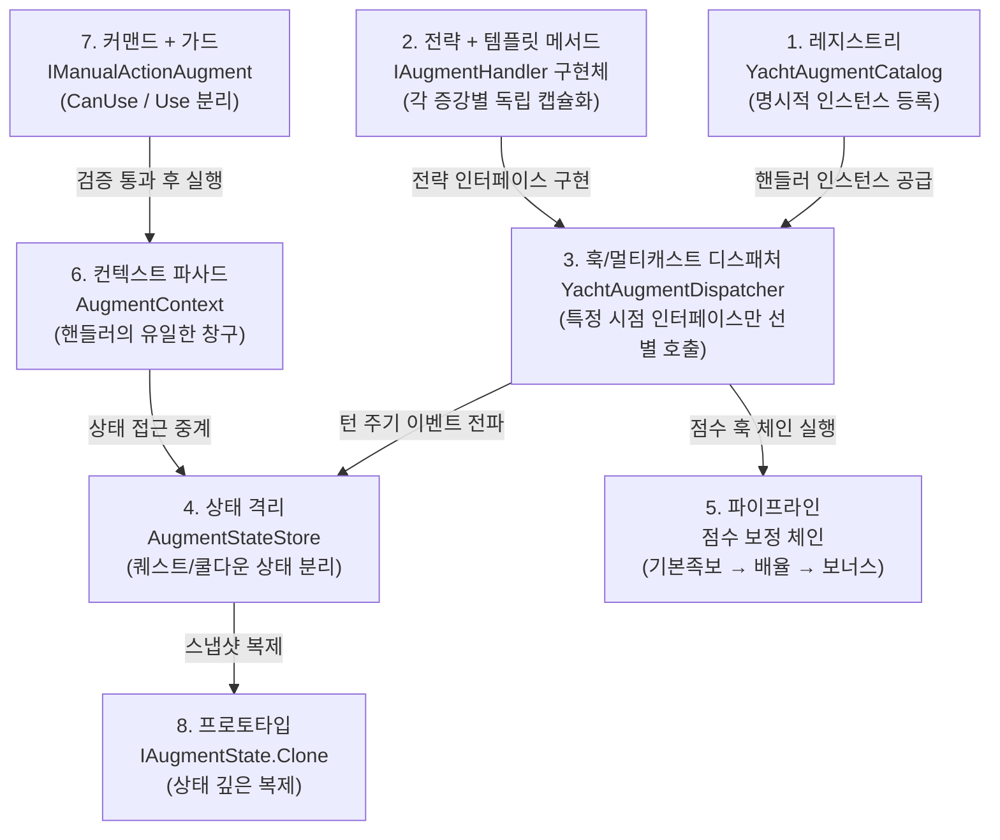
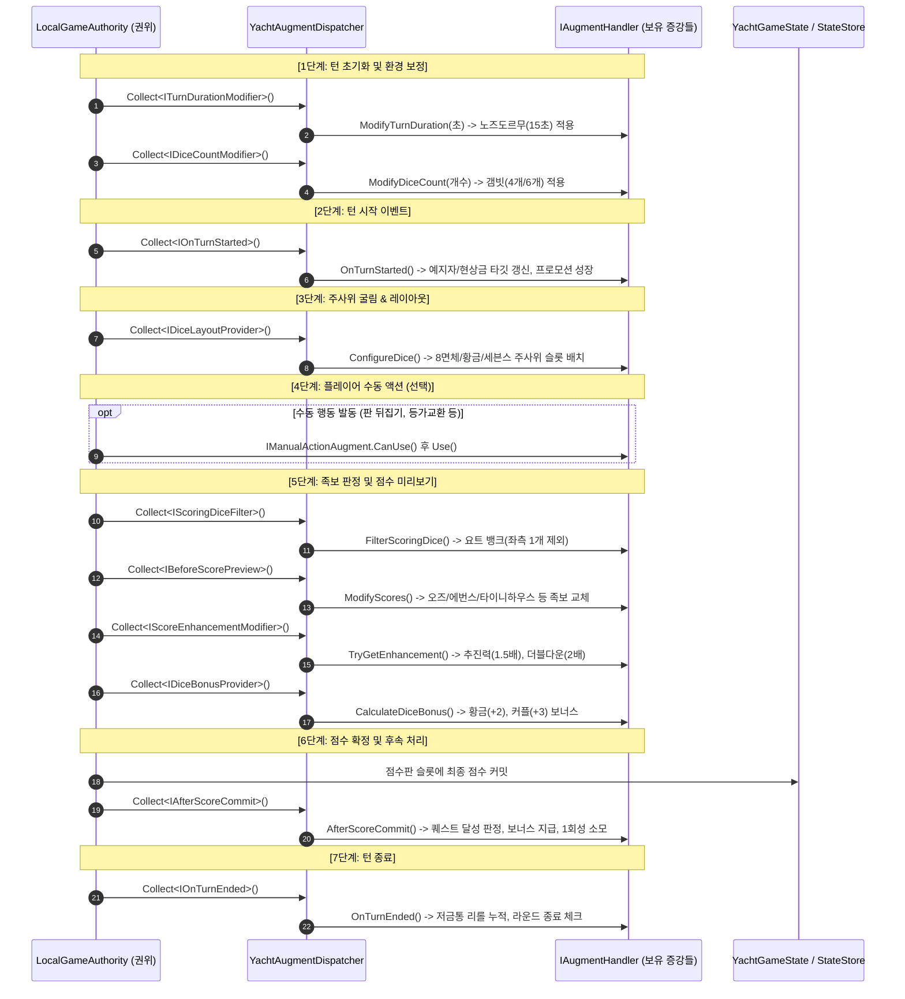

# Tessera 증강(Augments) 시스템 상세 명세 및 구현 현황서

> **문서 종류**: 기준 문서 (사람 대상)
> **코드 대조 기준**: 2026-09-13 · 커밋 `8cc0273`
> 이 문서는 위 시점의 코드에서 확인된 것만 기술합니다. 계획 항목은 상태 표기로 구분합니다.
> 작성 원칙은 [`docs/README.md`](../README.md)를 보십시오.

본 문서는 **Tessera(테세라)**의 핵심 게임플레이 메커니즘인 **증강(Augments) 시스템**의 아키텍처 디자인 패턴, 턴 수명주기와의 유기적 오케스트레이션, 점수 계산 파이프라인, 그리고 **55종 전수 구현 현황 및 상세 기술 명세**를 총망라한 개발자 가이드입니다.

---

## 목차 (Table of Contents)

1. [증강 시스템 개요](#1-증강-시스템-개요)
2. [핵심 아키텍처 및 5대 디자인 패턴](#2-핵심-아키텍처-및-5대-디자인-패턴)
3. [턴 생명주기(Turn Lifecycle)와 8단계 훅(Hook) 오케스트레이션](#3-턴-생명주기turn-lifecycle와-8단계-훅hook-오케스트레이션)
4. [점수 계산 파이프라인 및 상호 충돌(Conflict) 해결 규칙](#4-점수-계산-파이프라인-및-상호-충돌conflict-해결-규칙)
5. [증강 55종 전수 구현 현황 및 상세 명세표](#5-증강-55종-전수-구현-현황-및-상세-명세표)
   - [5.1 족보 변형(Modification) 18종 (DONE)](#51-족보-변형modification-18종-done)
   - [5.2 시스템 강화(Enhance) 11종 (DONE)](#52-시스템-강화enhance-11종-done)
   - [5.3 퀘스트/진행형(Quest) 11종 (DONE)](#53-퀘스트진행형quest-11종-done)
   - [5.4 수동 행동(Manual Action) 5종 (DONE)](#54-수동-행동manual-action-5종-done)
   - [5.5 의도적 미구현/보류(HOLD) 4종](#55-의도적-미구현보류hold-4종)
   - [5.6 영구 삭제(CUT) 6종](#56-영구-삭제cut-6종)
6. [런타임 상태 관리 (`AugmentStateStore`) 및 동기화](#6-런타임-상태-관리-augmentstatestore-및-동기화)
7. [검증 체계: 단위 테스트 및 샌드박스 디버그 패널](#7-검증-체계-단위-테스트-및-샌드박스-디버그-패널)

---

## 1. 증강 시스템 개요

**증강(Augments)**은 전통적인 요트 다이스의 족보 완성 규칙에 전략적 변수와 깊이를 부여하는 특수 카드 시스템입니다.
- 플레이어는 게임 중 3번의 드래프트 페이즈(라운드 1, 6, 9)를 거쳐 총 3장의 증강 카드를 획득·장착합니다.
- 증강은 단순히 고정된 수치를 더하는 것에 그치지 않고, **주사위 면의 기하학적 형태 교체(8면체, 황금 주사위)**, **특정 족보 달성 조건의 전면 재정의(소수 판정, 블랙잭, 피보나치)**, **다양한 턴 퀘스트 및 수동 발동 액션(판 뒤집기, 등가교환)** 등 게임의 전방위 룰을 동적으로 변형합니다.
- 따라서 증강 시스템은 단일 스크립트에 하드코딩될 수 없으며, **완전한 확장성(OCP)**과 **엄격한 결정론(Determinism)**을 갖춘 아키텍처로 설계되었습니다.

---

## 2. 핵심 아키텍처 및 8대 디자인 패턴

Tessera의 증강 시스템은 SOLID 원칙을 기반으로 아래 8개 패턴이 맞물려 구동됩니다.
각 절에는 **실제 구현 코드**를 그대로 실었습니다. 코드를 보러 파일을 열 필요가 없도록 한 것이며,
블록 첫 줄의 주석이 원본 위치입니다.



### 1) 전략 패턴 + 템플릿 메서드 (Strategy + Template Method)

**핵심 파일**: [IAugmentHandler.cs](../../Assets/Scripts/Games/AugmentedYacht/Logic/Augments/Core/IAugmentHandler.cs)

계약은 단 세 가지입니다. `Apply()` 같은 만능 진입점은 없습니다. 실제 발동 시점은 핸들러가 **추가로 구현한
훅 인터페이스**가 정하고, 디스패처가 그것을 보고 호출 대상을 고릅니다.

```csharp
// Assets/Scripts/Games/AugmentedYacht/Logic/Augments/Core/IAugmentHandler.cs:9-27
public interface IAugmentHandler
{
    string Id { get; }

    /// <summary>같은 시점에서 여러 증강이 발동할 때의 처리 순서입니다. 작을수록 먼저 처리합니다.</summary>
    int Order { get; }

    YachtAugmentDefinition CreateDefinition();
}

/// <summary>증강 처리기의 공통 기본 구현입니다.</summary>
public abstract class AugmentHandler : IAugmentHandler
{
    public abstract string Id { get; }

    public virtual int Order => 0;

    public abstract YachtAugmentDefinition CreateDefinition();
}
```

그 위에 분류별 추상 기반이 얹힙니다. `ModificationAugment`는 `ModifyScores`라는 **고정된 뼈대**를 쥐고,
변하는 한 지점만 `CalculateScore` 추상 훅으로 자식에게 넘깁니다. 이것이 템플릿 메서드입니다.

```csharp
// Assets/Scripts/Games/AugmentedYacht/Logic/Augments/Modification/ModificationAugment.cs:8-36
public abstract class ModificationAugment : AugmentHandler, IBeforeScorePreview
{
    public abstract string DisplayName { get; }

    public abstract string Description { get; }

    /// <summary>이 증강이 교체하는 족보 칸입니다.</summary>
    public abstract ScoreCategory Target { get; }

    /// <summary>1라운드에만 획득할 수 있으면 true입니다.</summary>
    public virtual bool PhaseOneOnly => false;

    public override YachtAugmentDefinition CreateDefinition() => new()
    {
        Id = Id,
        DisplayName = DisplayName,
        Description = Description,
        Target = Target.ToString(),
        Kind = YachtAugmentKind.Modification,
        PhaseOneOnly = PhaseOneOnly
    };

    public void ModifyScores(AugmentScoreContext context) =>
        context.Scores[Target] = CalculateScore(context.Facts);

    /// <summary>대상 칸에 넣을 점수입니다.</summary>
    protected abstract int CalculateScore(YachtDiceFacts facts);
}
```

결과적으로 **증강 하나를 추가하는 비용이 파일 하나**입니다. 아래가 실제 증강 한 종의 전문입니다.
런타임에 분기를 더하지 않았고, 다른 파일을 고치지도 않았습니다.

```csharp
// Assets/Scripts/Games/AugmentedYacht/Logic/Augments/Modification/Evens.cs (전문)
/// <summary>Small Straight를 모든 눈이 2·4·6이면 20점인 족보로 바꿉니다.</summary>
public sealed class Evens : ModificationAugment
{
    public override string Id => YachtAugmentRuntime.EvensId;

    public override string DisplayName => "에번스";

    public override string Description => "Small Straight를 모든 눈이 2·4·6이면 20점인 족보로 바꿉니다.";

    public override ScoreCategory Target => ScoreCategory.SmallStraight;

    protected override int CalculateScore(YachtDiceFacts facts) => facts.AllInSet(2, 4, 6) ? 20 : 0;
}
```

> 클래스 이름에 `Handler` 접미사를 붙이지 않습니다. 파일명은 증강 이름 그대로입니다.

### 2) 훅 & 멀티캐스트 디스패처 (Hook / Multi-cast Dispatcher)

**핵심 파일**: [YachtAugmentDispatcher.cs](../../Assets/Scripts/Games/AugmentedYacht/Logic/Augments/Core/YachtAugmentDispatcher.cs)

인터페이스 분리 원칙(ISP)에 따라 개입 시점별로 세분화된 인터페이스가 있고, 디스패처는 **그 인터페이스를
구현한 핸들러만** 골라 결정론적 순서로 돌려줍니다. 정렬은 `Order`가 먼저이고, 같으면 카탈로그 등록
순서입니다. 이 두 단계 덕분에 같은 입력이면 어느 기기에서든 같은 결과가 납니다.

```csharp
// Assets/Scripts/Games/AugmentedYacht/Logic/Augments/Core/YachtAugmentDispatcher.cs:12-22, 40-64
public static List<T> Collect<T>(YachtGameState state, int playerIndex) where T : class
{
    var result = new List<T>();
    if (state?.AugmentPlayers == null || playerIndex < 0 || playerIndex >= state.AugmentPlayers.Length)
        return result;

    Append(state.AugmentPlayers[playerIndex].OwnedIds, result);
    Append(state.GlobalAugmentIds, result);
    if (result.Count > 1) result.Sort(CompareHandlers);
    return result;
}

private static void Append<T>(IReadOnlyList<string> augmentIds, List<T> result) where T : class
{
    for (int i = 0; i < (augmentIds?.Count ?? 0); i++)
    {
        IAugmentHandler handler = YachtAugmentCatalog.Find(augmentIds[i]);
        if (handler is T typed && !Contains(result, typed)) result.Add(typed);   // 타입으로 선별
    }
}

private static int CompareHandlers<T>(T left, T right) where T : class
{
    var leftHandler = (IAugmentHandler)left;
    var rightHandler = (IAugmentHandler)right;
    int byOrder = leftHandler.Order.CompareTo(rightHandler.Order);
    return byOrder != 0
        ? byOrder
        : YachtAugmentCatalog.IndexOf(leftHandler).CompareTo(YachtAugmentCatalog.IndexOf(rightHandler));
}
```

`Collect<T>`가 **한 플레이어의 보유 증강**만 훑는 반면, `CollectAll<T>`는 판 위의 모든 증강을 훑습니다.
결투처럼 양쪽 결과를 함께 보고 판정하는 증강은 처리 주체와 보유자가 다르기 때문입니다.
실제로 `IOnTurnEnded` 하나만 `CollectAll`로 호출됩니다 (3장 참조).

호출부는 항상 같은 모양입니다. 컨텍스트에 **어느 증강이 지금 말하고 있는지** 묶은 뒤 훅을 부릅니다.
이 `BindAugment` 한 줄이 있어 핸들러가 자기 전용 상태에만 닿을 수 있습니다.

```csharp
// Assets/Scripts/Games/AugmentedYacht/Logic/YachtAugmentRuntime.cs:602-612
YachtDiceFacts facts = YachtAugmentScoreEngine.CreateFacts(
    scoringDice, state.AugmentPlayers[playerIndex].OwnedIds);
Dictionary<ScoreCategory, int> scores = YachtAugmentScoreEngine.CalculateBaseScores(facts);
var context = new AugmentScoreContext(state, playerIndex, scoringDice, scores, facts);
List<IBeforeScorePreview> handlers = YachtAugmentDispatcher.Collect<IBeforeScorePreview>(state, playerIndex);
for (int i = 0; i < handlers.Count; i++)
{
    context.BindAugment(((IAugmentHandler)handlers[i]).Id);
    handlers[i].ModifyScores(context);
}
return scores;
```

### 3) 상태 격리 (Isolated State)

**핵심 파일**: [AugmentStateStore.cs](../../Assets/Scripts/Games/AugmentedYacht/Logic/Augments/Core/AugmentStateStore.cs), [IAugmentState.cs](../../Assets/Scripts/Games/AugmentedYacht/Logic/Augments/Core/IAugmentState.cs)

퀘스트 누적 카운트, 스킬 사용 여부, 주사위 성장 단계 같은 가변 상태를 권위 데이터 구조
(`YachtGameState`)에 계속 덧붙이지 않고, 증강별 전용 DTO로 격리해 보관합니다.
타입이 어긋나면 조용히 넘어가지 않고 **예외로 터뜨립니다.**

```csharp
// Assets/Scripts/Games/AugmentedYacht/Logic/Augments/Core/AugmentStateStore.cs:11-40
public sealed class AugmentStateStore
{
    private string[] ids = Array.Empty<string>();
    private IAugmentState[] states = Array.Empty<IAugmentState>();

    /// <summary>해당 증강의 상태를 반환하고, 없으면 만들어서 보관합니다.</summary>
    public T GetOrCreate<T>(string augmentId) where T : class, IAugmentState, new()
    {
        int index = IndexOf(augmentId);
        if (index >= 0)
        {
            if (states[index] is T existing) return existing;
            throw new InvalidOperationException(
                $"증강 '{augmentId}'의 상태가 이미 {states[index].GetType().Name}으로 보관되어 있어 {typeof(T).Name}으로 읽을 수 없습니다.");
        }

        var created = new T();
        Array.Resize(ref ids, ids.Length + 1);
        Array.Resize(ref states, states.Length + 1);
        ids[ids.Length - 1] = augmentId;
        states[states.Length - 1] = created;
        return created;
    }

    /// <summary>상태를 만들지 않고 조회합니다. 없으면 null입니다.</summary>
    public IAugmentState Find(string augmentId)
    {
        int index = IndexOf(augmentId);
        return index >= 0 ? states[index] : null;
    }
```

> 삽입 순서를 유지하는 병렬 배열이라 복제와 순회 결과가 결정적입니다. Unity 직렬화는 인터페이스 배열을
> 다루지 못하므로 이 저장소 자체는 직렬화 대상이 아닙니다.

### 4) 파이프라인 체인 (Pipeline)

점수는 단일 수식으로 끝나지 않고 **기본 족보 평가 → 족보 룰 교체(`IBeforeScorePreview`) →
배율 강화(`IScoreEnhancementModifier`) → 주사위 고정 보너스(`IDiceBonusProvider`)** 순으로
단계를 통과합니다. 4장의 수식이 그대로 코드에 있습니다.

```csharp
// Assets/Scripts/Games/AugmentedYacht/Logic/YachtAugmentRuntime.cs:638-671
for (int i = 0; i < result.Length; i++)
{
    ScoreCategory category = YachtScoreCalculator.ScorableCategories[i];
    int baseScore = baseScores[category];
    float multiplier = 1f;
    string enhancementSource = null;

    for (int m = 0; m < modifiers.Count; m++)
    {
        queryContext.BindAugment(((IAugmentHandler)modifiers[m]).Id);
        if (modifiers[m].TryGetEnhancement(queryContext, category, baseScore, out float mult, out string source))
        {
            multiplier = multiplier > 1f ? 2f : mult;        // 배율은 2배에서 상한
            enhancementSource = enhancementSource != null ? $"{enhancementSource}+{source}" : source;
        }
    }

    if (player.DoubleDownActive && baseScore > 0 && (enhancementSource == null || !enhancementSource.Contains("DoubleDown")))
    {
        multiplier = multiplier > 1f ? 2f : 1.5f;
        enhancementSource = enhancementSource != null ? $"{enhancementSource}+DoubleDown" : "DoubleDown";
    }

    int enhanced = (int)Math.Floor(baseScore * multiplier);
    int finalScore = baseScore == 0 ? 0 : enhanced + diceBonus;   // 스크래치(0점)는 어떤 보정도 받지 않는다
    result[i] = new YachtScoreCandidate
    {
        Category = category,
        BaseScore = baseScore,
        DiceBonusScore = diceBonus,
        Score = finalScore,
        IsEnhanced = multiplier > 1f,
        EnhancementSource = enhancementSource
    };
}
```

> `baseScore == 0 ? 0 : ...` 한 줄이 **스크래치 0점 원칙**의 전부입니다. 기본 점수가 0이면 배율도
> 주사위 보너스도 붙지 않습니다. 0점 칸을 증강으로 되살리는 우회로가 생기지 않게 막는 지점입니다.

### 5) 레지스트리 (Registry)

**핵심 파일**: [YachtAugmentCatalog.cs](../../Assets/Scripts/Games/AugmentedYacht/Logic/Augments/Core/YachtAugmentCatalog.cs)

리플렉션 런타임 검색은 Unity IL2CPP / AOT 빌드에서 코드 스트리핑과 성능 저하를 부릅니다.
그래서 45개 핸들러를 **정적 배열에 손으로 등록**합니다. 등록 순서가 곧 드래프트 후보와 정의 목록의
노출 순서이며, 디스패처 정렬의 2차 기준이기도 합니다.

```csharp
// Assets/Scripts/Games/AugmentedYacht/Logic/Augments/Core/YachtAugmentCatalog.cs:11-20, 68-84
public static class YachtAugmentCatalog
{
    private static readonly IAugmentHandler[] Handlers =
    {
        // 변형 18종. 등록 순서가 드래프트 후보와 정의 목록의 노출 순서가 됩니다.
        new LuckySevens(),
        new PerfectSquares(),
        new Gambler(),
        new ThreeOfAKind(),
        // ... 강화 11종, 퀘스트 11종, 수동 행동 5종이 이어집니다 (합계 45개)
    };

    public static IReadOnlyList<IAugmentHandler> All => Handlers;

    public static IAugmentHandler Find(string augmentId)
    {
        for (int i = 0; i < Handlers.Length; i++)
            if (string.Equals(Handlers[i].Id, augmentId, StringComparison.Ordinal)) return Handlers[i];
        return null;
    }

    /// <summary>등록 목록의 순서를 반환합니다. 같은 <c>Order</c>일 때의 정렬 기준입니다.</summary>
    internal static int IndexOf(IAugmentHandler handler)
    {
        for (int i = 0; i < Handlers.Length; i++)
            if (ReferenceEquals(Handlers[i], handler)) return i;
        return int.MaxValue;
    }
}
```

> `Handlers`는 `private`입니다. 외부에서 쓰는 창구는 `All`, `Find(string)`, `IndexOf` 셋입니다.
> **여기에 등록하지 않은 증강은 존재하지 않는 것과 같습니다.** 보류(HOLD) 4종과 삭제(CUT) 6종을
> 배제하는 별도 블랙리스트가 없는 이유가 이것입니다. 카탈로그에 인스턴스가 없으면 자동으로 빠집니다.

### 6) 컨텍스트 파사드 (Context Object)

**핵심 파일**: [AugmentContexts.cs](../../Assets/Scripts/Games/AugmentedYacht/Logic/Augments/Core/AugmentContexts.cs)

핸들러는 `YachtGameState`를 직접 만지지 않습니다. 할 수 있는 일이 컨텍스트가 열어 준 몇 개의 메서드로
좁혀져 있고, 그것이 곧 증강이 게임에 개입할 수 있는 범위의 정의입니다.

```csharp
// Assets/Scripts/Games/AugmentedYacht/Logic/Augments/Core/AugmentContexts.cs:52-74
/// <summary>현재 증강의 전용 상태를 가져옵니다. 없으면 만들어집니다.</summary>
public T State<T>() where T : class, IAugmentState, new() => Player.States.GetOrCreate<T>(AugmentId);

/// <summary>증강 발동 이벤트를 발행합니다.</summary>
public void Emit(string message, int score = 0)
{
    events?.Add(new YachtGameEvent
    {
        Type = YachtGameEventType.AugmentTriggered,
        PlayerIndex = PlayerIndex,
        AugmentId = AugmentId,
        Score = score,
        Message = message
    });
}

/// <summary>증강 보너스 점수를 더하고 총점을 다시 계산한 뒤 이벤트를 발행합니다.</summary>
public void AddBonus(int points, string message)
{
    Score.augmentBonusScore += points;
    Score.RecalculateTotal();
    Emit(message, points);
}
```

`State<T>()`가 `AugmentId`를 암묵적으로 넘기는 데 주의하십시오. 그 ID는 디스패처 호출부의
`BindAugment`가 방금 묶어 준 값이므로, 핸들러는 **남의 상태를 읽을 방법이 없습니다.**

### 7) 커맨드 + 가드 (Command with Guard)

**핵심 파일**: [IAugmentHandler.cs](../../Assets/Scripts/Games/AugmentedYacht/Logic/Augments/Core/IAugmentHandler.cs) `:98-110`

플레이어가 버튼을 눌러 쓰는 수동 행동 증강은 **검증(`CanUse`)과 실행(`Use`)이 분리**돼 있습니다.
UI는 `CanUse`만 불러 버튼 활성화를 정하고, 권위는 실행 직전에 같은 함수를 다시 부릅니다.
거절 사유가 문자열이 아니라 `YachtCommandErrorCode` 열거형이라 네트워크 너머로도 그대로 옮겨집니다.

```csharp
// Assets/Scripts/Games/AugmentedYacht/Logic/Augments/Enhance/TableFlip.cs:38-69
public bool CanUse(AugmentActionContext context, out YachtCommandErrorCode code, out string message)
{
    code = YachtCommandErrorCode.None;
    message = null;
    if (!context.Owns(Id))
    {
        code = YachtCommandErrorCode.AugmentRequired;
        message = "판 뒤집기 증강을 보유하지 않았습니다.";
        return false;
    }
    var state = GetOrSync(context);
    if (state.IsUsed)
    {
        code = YachtCommandErrorCode.AugmentAlreadyUsed;
        message = "판 뒤집기를 이미 사용했습니다.";
        return false;
    }
    if (!context.Game.HasRolled)
    {
        code = YachtCommandErrorCode.RollRequired;
        message = "첫 굴림 후 판 뒤집기를 사용할 수 있습니다.";
        return false;
    }
    return true;
}

public void Use(AugmentActionContext context)
{
    var state = GetOrSync(context);
    state.IsUsed = true;
    context.Player.TableFlipUsed = true;
}
```

배율 강화는 상태 머신으로 구현된 경우가 있습니다. 아래 `Momentum`은 `0 → 1 → 2` 세 단계를 오가며
"직전에 0점을 냈으면 이번 득점에 1.5배"라는 규칙을 두 훅에 나눠 담습니다.

```csharp
// Assets/Scripts/Games/AugmentedYacht/Logic/Augments/Enhance/Momentum.cs:39-65
public bool TryGetEnhancement(AugmentQueryContext context, ScoreCategory category, int baseScore, out float multiplier, out string enhancementSource)
{
    var state = GetOrSync(context);
    if (state.State == 1 && baseScore > 0)
    {
        multiplier = 1.5f;
        enhancementSource = "Momentum";
        return true;
    }
    multiplier = 1f;
    enhancementSource = null;
    return false;
}

public void AfterScoreCommit(AugmentCommitContext context)
{
    var state = GetOrSync(context);
    if (state.State == 0 && context.BaseScore == 0)
    {
        state.State = 1;
    }
    else if (state.State == 1 && context.BaseScore > 0)
    {
        state.State = 2;
    }
    context.Player.MomentumState = state.State;
}
```

주사위를 다루는 강화는 `IDiceLayoutProvider`(슬롯 확보와 배정)와 `IDiceBonusProvider`(보너스 계산)를
함께 구현합니다. 한 증강이 여러 훅을 겸하는 표준형입니다.

```csharp
// Assets/Scripts/Games/AugmentedYacht/Logic/Augments/Enhance/GoldenDie.cs:6-27
public sealed class GoldenDie : EnhanceAugment, IDiceLayoutProvider, IDiceBonusProvider
{
    public override string Id => YachtAugmentRuntime.GoldenDieId;

    public override string DisplayName => "황금 주사위";

    public override string Description => "기본 주사위 1개를 황금 주사위로 바꿉니다. 눈이 1~3이면 +2점 보너스를 얻습니다.";

    public int RequiredDiceSlots => 1;

    public void ConfigureDice(AugmentDiceContext context) => context.Assign(YachtDieType.Golden, 1);

    public int CalculateDiceBonus(AugmentQueryContext context, IReadOnlyList<YachtDieState> dice)
    {
        int bonus = 0;
        for (int i = 0; i < (dice?.Count ?? 0); i++)
        {
            YachtDieState die = dice[i];
            if (die.Type == YachtDieType.Golden && die.Value >= 1 && die.Value <= 3) bonus += 2;
        }
        return bonus;
    }
}
```

### 8) 프로토타입 (Prototype)

**핵심 파일**: [IAugmentState.cs](../../Assets/Scripts/Games/AugmentedYacht/Logic/Augments/Core/IAugmentState.cs)

상태와 정의는 전부 `Clone()` 계약을 집니다. 권위가 상태 스냅샷을 뷰에 넘길 때 참조가 아니라 복제본을
주기 때문에, 프레젠테이션 계층이 실수로 권위 상태를 건드릴 수 없습니다.

```csharp
// Assets/Scripts/Games/AugmentedYacht/Logic/Augments/Quest/NoTimeToWaste.cs:5-18
[Serializable]
public sealed class NoTimeToWasteState : IAugmentState
{
    public int RemainingTurns = 3;
    public bool Failed;
    public bool Rewarded;

    public IAugmentState Clone() => new NoTimeToWasteState
    {
        RemainingTurns = RemainingTurns,
        Failed = Failed,
        Rewarded = Rewarded
    };
}
```

**ScriptableObject 기반 데이터 주도 설계는 쓰지 않습니다.** 증강 45종은 전부 C# 코드로 정의돼 있고,
증강용 `.asset` 파일은 하나도 없습니다. `Assets/StreamingAssets/WebSource/data/augments.json`에 원본
기획 데이터 55개 항목이 남아 있지만 런타임 코드는 이 파일을 읽지 않습니다. 출처 참고용입니다.

---

## 3. 턴 생명주기(Turn Lifecycle)와 8단계 훅(Hook) 오케스트레이션

턴이 시작되어 주사위를 굴리고 점수를 확정할 때까지, 증강 인터페이스들이 호출되는 시점과 데이터 교환 흐름입니다.



### 시점별 인터페이스 명세표
| 단계 | 호출 인터페이스 | 전달 Context | 주요 담당 증강 예시 |
|---|---|---|---|
| **선택** | `IOnAugmentSelected` | `AugmentSelectionContext` | `random-box`(무작위 교체 및 상단 58 설정) |
| **턴 준비** | `IDiceCountModifier`<br/>`ITurnDurationModifier` | `AugmentQueryContext` | `gambit`(주사위 수 조절)<br/>`nozdormu`(타이머 15초 단축) |
| **턴 시작** | `IOnTurnStarted` | `AugmentTurnContext` | `promotion-die`(눈금+1 성장)<br/>`bounty-hunter`(사냥 타깃 제시) |
| **주사위 구성** | `IDiceLayoutProvider` | `AugmentDiceContext` | `8-sided`(8면체 배치)<br/>`golden-die`(황금 주사위 배치) |
| **수동 발동** | `IManualActionAugment` | `AugmentActionContext` | `table-flip`(무료 재굴림)<br/>`equivalent-exchange`(추가 굴림) |
| **점수 필터** | `IScoringDiceFilter` | `AugmentQueryContext` | `yacht-bank`(왼쪽 주사위 점수 계산 제외) |
| **족보/점수** | `IBeforeScorePreview`<br/>`IScoreEnhancementModifier`<br/>`IDiceBonusProvider` | `AugmentScoreContext`<br/>`AugmentQueryContext` | `evens`, `odds`, `tiny-house`(족보 교체)<br/>`momentum`(1.5배)<br/>`couple-dice`(+3) |
| **점수 확정 후** | `IAfterScoreCommit` | `AugmentCommitContext` | `fast-straight`, `holdout`(퀘스트 보상)<br/>`bounty-hunter`(사냥 성공/실패 정산) |
| **턴 종료** | `IOnTurnEnded` | `AugmentCommitContext` | `piggy-bank`(남은 리롤×3 저금) |

> **`IOnTurnEnded`만 수집 방식이 다릅니다.** 나머지 훅은 `Collect<T>`로 현재 플레이어의 보유 증강만
> 훑지만, `IOnTurnEnded`는 `CollectAll<T>`로 판 위의 모든 증강을 훑습니다. 결투처럼 양쪽 플레이어의
> 라운드 점수를 함께 보고 판정하는 증강은 처리 주체와 보유자가 다르기 때문입니다.
>
> 같은 이유로 라운드 점수 기록 자체는 훅 바깥에서 항상 수행합니다. 증강 보유 여부로 기록을 막으면
> 먼저 기입한 쪽의 점수가 비어 판정이 불가능해집니다.

```csharp
// Assets/Scripts/Games/AugmentedYacht/Logic/YachtAugmentRuntime.cs:712-722
// 라운드 점수 기록은 증강 보유와 무관한 코어 상태다. 결투를 라운드 도중에 획득하는
// 경로(드래프트 라운드의 턴 전환)가 있어 보유 여부로 게이팅하면 먼저 기입한 쪽의
// 점수가 비어 판정이 불가능해진다. 그래서 기록은 항상 하고 판정만 훅에 맡긴다.
RecordRoundScore(state, playerIndex, finalScore);

List<IOnTurnEnded> turnEndHandlers = YachtAugmentDispatcher.CollectAll<IOnTurnEnded>(state);
for (int i = 0; i < turnEndHandlers.Count; i++)
{
    commitContext.BindAugment(((IAugmentHandler)turnEndHandlers[i]).Id);
    turnEndHandlers[i].OnTurnEnded(commitContext);
}
```


---

## 4. 점수 계산 파이프라인 및 상호 충돌(Conflict) 해결 규칙

### 4.1 점수 계산 4단계 계층 공식

최종 점수는 다음과 같은 계층 순서로 계산됩니다:

$$\text{FinalScore} = \Big(\lfloor \text{BaseScore} \times \text{EnhancementMultiplier} \rfloor \Big) + \text{DiceBonus} + \text{InstantQuestReward}$$

1. **1단계 (기본 족보 평가 및 교체)**:
   - 주사위 눈금을 바탕으로 기본 족보를 계산합니다. 만약 `IBeforeScorePreview` 증강(예: `evens`, `tiny-house`, `mountain`)을 보유하고 조건을 만족하면, 해당 카테고리의 기본 점수가 교체 점수로 치환됩니다.
2. **2단계 (배율 강화 적용)**:
   - `momentum`(추진력: 1.5배), `double-down`(더블 다운: 1.5배/추진력 동시 보유 시 2.0배) 효과를 곱한 뒤 소수점을 버립니다(`floor`).
3. **3단계 (주사위 고정 보너스 합산)**:
   - `golden-die`(+2/개), `couple-dice`(+3) 등의 보너스를 배율 계산이 끝난 결과에 **단순 가산**합니다 (주사위 보너스가 배율로 증폭되는 밸런스 붕괴 방지).
4. **4단계 (퀘스트 및 일시 보상 가산)**:
   - 턴 종료 시점 달성된 퀘스트 보너스를 최종 합산합니다.

> [!CRITICAL]
> **스크래치(0점) 절대 원칙**:
> 1단계의 기본 족보 점수가 `0점`인 경우, 주사위 고정 보너스(황금 주사위 등)가 있더라도 **최종 점수는 무조건 0점(스크래치)**으로 처리됩니다. 보너스 점수만 믿고 엉뚱한 칸에 점수를 넣는 꼼수를 원천 차단합니다.

### 4.2 충돌(Conflict) 및 상호 배제 규칙

1. **동일 카테고리 슬롯 교체 충돌**:
   - `lucky-sevens`와 `perfect-squares`는 둘 다 `Aces` 카테고리를 변형합니다.
   - 플레이어는 동일한 카테고리를 대상으로 하는 족보 변형 카드를 2장 이상 동시에 보유할 수 없습니다 (드래프트 알고리즘에서 상호 배제 필터링).
2. **주사위 형태 및 물리 조작 충돌**:
   - `8-sided`(8면체 주사위)를 보유한 상태에서는 `table-flip`(판 뒤집기)을 선택할 수 없습니다. 8면체 메시 궤적과 판 뒤집기 궤적 프리셋 간의 연출 충돌을 방지합니다.
3. **드래프트 등장 라운드 제한 (기한 만료 방지)**:
   - `fast-straight`(8라운드 내 완료 필요), `step-by-step`(Aces부터 순차 완료 필요) 등은 후반 드래프트에 등장하면 달성이 원천 불가능하므로, 라운드 1 드래프트에서만 등장하도록 제한됩니다.
4. **개인 적용 및 점수판 스티커 원칙**:
   - 2인 대전 시 변형 카드는 **오직 카드를 집은 플레이어에게만 적용**됩니다.
   - 상대방 점수판에는 영향을 주지 않으며, 현재 턴 플레이어의 점수판 위에 **동적 스티커 오버레이** 형태로 변형된 족보명이 표시됩니다.

---


#### 구현 위치

세 규칙은 하나의 함수가 아니라 **서로 다른 세 가지 메커니즘**으로 구현돼 있습니다. 드래프트 후보를
고를 때 `CanAcquire`가 이 셋을 차례로 통과시킵니다.

| 규칙 | 메커니즘 | 위치 |
|---|---|---|
| 동일 카테고리 배제 | 보유 중인 변형 증강의 `Target` 문자열 비교 | `YachtAugmentRuntime.cs:903-911` |
| 개별 충돌 선언 | 증강이 `Conflicts` 배열로 선언하고 `HasConflict`가 **양방향** 검사 | `TableFlip.cs:22`, `YachtAugmentRuntime.cs:921-933` |
| 라운드 제한 | 정의의 `PhaseOneOnly` 플래그 | `YachtAugmentRuntime.cs:899` |

```csharp
// Assets/Scripts/Games/AugmentedYacht/Logic/YachtAugmentRuntime.cs:895-919
private bool CanAcquire(YachtGameState state, int playerIndex, string augmentId)
{
    YachtAugmentDefinition definition = FindDefinition(augmentId);
    if (definition == null) return false;
    if (definition.PhaseOneOnly && state.CurrentRound != 1) return false;          // 라운드 제한
    if (definition.IsGlobal && Contains(state.GlobalAugmentIds, augmentId)) return false;
    YachtAugmentPlayerState player = state.AugmentPlayers[playerIndex];
    if (Contains(player.OwnedIds, augmentId) || HasConflict(player, augmentId)) return false;  // 개별 충돌
    if (definition.Kind == YachtAugmentKind.Modification)
    {
        for (int i = 0; i < player.OwnedIds.Length; i++)
        {
            YachtAugmentDefinition owned = FindDefinition(player.OwnedIds[i]);
            if (owned?.Kind == YachtAugmentKind.Modification
                && string.Equals(owned.Target, definition.Target, StringComparison.Ordinal)) return false;  // 동일 카테고리
        }
    }
    int required = RequiredDiceSlots(augmentId);
    if (required > 0)
    {
        for (int i = 0; i < player.OwnedIds.Length; i++) required += RequiredDiceSlots(player.OwnedIds[i]);
        if (required > 5) return false;                                            // 주사위 슬롯 예산 5개
    }
    return true;
}
```

충돌 선언은 한쪽만 적어도 됩니다. `HasConflict`가 후보와 보유분을 양방향으로 대조하기 때문입니다.
실제로 `8-sided`와 `table-flip`의 충돌은 [TableFlip.cs](../../Assets/Scripts/Games/AugmentedYacht/Logic/Augments/Enhance/TableFlip.cs)
한쪽에만 `Conflicts => new[] { YachtAugmentRuntime.OctahedronId }`로 적혀 있습니다.

```csharp
// Assets/Scripts/Games/AugmentedYacht/Logic/YachtAugmentRuntime.cs:921-933
private bool HasConflict(YachtAugmentPlayerState player, string candidateId)
{
    YachtAugmentDefinition candidate = FindDefinition(candidateId);
    if (candidate == null) return false;
    for (int i = 0; i < player.OwnedIds.Length; i++)
    {
        string ownedId = player.OwnedIds[i];
        if (Contains(candidate.Conflicts, ownedId)) return true;      // 후보가 보유분을 거부
        YachtAugmentDefinition owned = FindDefinition(ownedId);
        if (owned != null && Contains(owned.Conflicts, candidateId)) return true;  // 보유분이 후보를 거부
    }
    return false;
}
```

주사위 슬롯 예산은 `IDiceLayoutProvider.RequiredDiceSlots`의 합이 5를 넘지 못하게 막습니다.
주사위가 5개뿐이므로, 주사위를 요구하는 증강을 무한히 쌓을 수 없습니다.

```csharp
// Assets/Scripts/Games/AugmentedYacht/Logic/YachtAugmentRuntime.cs:935-940
private static int RequiredDiceSlots(string augmentId)
{
    if (YachtAugmentCatalog.Find(augmentId) is IDiceLayoutProvider provider)
        return provider.RequiredDiceSlots;
    return 0;
}
```

---

## 5. 증강 55종 전수 구현 현황 및 상세 명세표

> **구현 현황 종합**:
> - **완전 구현 및 검증 완료**: **45종 (DONE)**
> - **의도적 미구현 및 기획 보류**: **4종 (HOLD)** (`four-by-four`, `two-households`, `strange-die`, `coin-toss`)
> - **영구 삭제**: **6종 (CUT)** (3~8번 안티 계열 족보)

---

### 5.1 족보 변형(Modification) 18종 (DONE)
기존 점수판의 12개 카테고리 룰을 다른 조건과 점수 공식으로 전면 치환하는 증강입니다.

| No | ID | 이름 | 대상 카테고리 | 치환 조건 및 효과 | 발동 훅 | C# 구현 클래스 | 상태 |
|:---:|---|---|---|---|---|---|:---:|
| **1** | `lucky-sevens` | 럭키 세븐 | `Aces` | 눈금 합이 7, 17, 27이면 15점 (상단 합산 포함) | `IBeforeScorePreview` | `LuckySevens` | `DONE` |
| **2** | `perfect-squares` | 퍼펙트 스퀘어 | `Aces` | 눈금 합이 9, 16, 25이면 12점 (상단 합산 포함) | `IBeforeScorePreview` | `PerfectSquares` | `DONE` |
| **9** | `gambler` | 갬블러 | `Choice` | 눈금 합이 24 이상이면 합계 + 7점 | `IBeforeScorePreview` | `Gambler` | `DONE` |
| **10** | `three-of-a-kind` | 쓰리 오브 어 카인드 | `FourOfAKind` | 같은 눈 3개 이상이면 모든 주사위 눈금 합계 | `IBeforeScorePreview` | `ThreeOfAKind` | `DONE` |
| **12** | `tiny-house` | 타이니 하우스 | `FullHouse` | 5, 6, 7 없이(1~4로만) 풀하우스 달성 시 28점 | `IBeforeScorePreview` | `TinyHouse` | `DONE` |
| **13** | `two-pair` | 투 페어 | `FullHouse` | 서로 다른 2쌍 또는 4개 이상 동일 눈금 시 15점 | `IBeforeScorePreview` | `TwoPair` | `DONE` |
| **14** | `head-and-tail` | 머리와 몸통 | `FullHouse` | 1페어 + 연속된 3개 눈금 조합 시 합계 + 10점 | `IBeforeScorePreview` | `HeadAndTail` | `DONE` |
| **15** | `evens` | 에번스 | `SmallStraight` | 모든 주사위가 짝수(2, 4, 6)이면 20점 | `IBeforeScorePreview` | `Evens` | `DONE` |
| **16** | `odds` | 오즈 | `SmallStraight` | 모든 주사위가 홀수(1, 3, 5, 7)이면 20점 | `IBeforeScorePreview` | `Odds` | `DONE` |
| **17** | `double-large-straight` | 더블 라지 스트레이트 | `SmallStraight` | 스몰 스트레이트를 라지 스트레이트(30점)로 치환, 상단 보너스 기준을 60으로 완화 | `IBeforeScorePreview`<br/>`IOnAugmentSelected` | `DoubleLargeStraight` | `DONE` |
| **18** | `prime-collection` | 프라임 컬렉션 | `LargeStraight` | 모든 눈이 소수(2,3,5,7)이고 2,3,5가 모두 포함되면 35점 | `IBeforeScorePreview` | `PrimeCollection` | `DONE` |
| **19** | `duplex-house` | 땅콩주택 | `FullHouse` | 차이가 정확히 1인 두 숫자로 풀하우스 달성 시 35점 (예: 222-33) | `IBeforeScorePreview` | `DuplexHouse` | `DONE` |
| **20** | `mountain` | 마운틴 | `LargeStraight` | 정확히 2, 3, 4, 5, 6 조합이면 40점 | `IBeforeScorePreview` | `Mountain` | `DONE` |
| **21** | `high-dice` | 하이 다이스 | `LargeStraight` | 모든 눈이 4, 5, 6, 7이고 합계가 26 이상이면 35점 | `IBeforeScorePreview` | `HighDice` | `DONE` |
| **22** | `2nd-choice` | 두 번째 초이스 | `Yacht` | 요트 칸을 주사위 눈금 합계의 절반(내림)으로 기입 | `IBeforeScorePreview` | `SecondChoice` | `DONE` |
| **23** | `fibonacci-numbers` | 피보나치 넘버즈 | `Yacht` | 정렬된 눈금이 정확히 [1, 1, 2, 3, 5]이면 25점 | `IBeforeScorePreview` | `FibonacciNumbers` | `DONE` |
| **24** | `reverse-choice` | 리버스 초이스 | `Yacht` | 요트 칸을 `30 - 합계`로 기입 (음수 점수 허용 및 총점 차감) | `IBeforeScorePreview` | `ReverseChoice` | `DONE` |
| **26** | `blackjack-21` | 블랙잭 21 | `Yacht` | 주사위 5개의 눈금 합이 정확히 21이면 21점 | `IBeforeScorePreview` | `Blackjack21` | `DONE` |

---

### 5.2 시스템 강화(Enhance) 11종 (DONE)
주사위의 물리 형태를 바꾸거나 보너스 점수 및 추가 혜택을 주는 강화 증강입니다.

| No | ID | 이름 | 유형 | 효과 설명 | 발동 훅 | C# 구현 클래스 | 상태 |
|:---:|---|---|---|---|---|---|:---:|
| **25** | `yacht-bank` | 요트 뱅크 | 점수 저축 | 3턴 동안 점수 확정 시 킵 존 가장 왼쪽 주사위를 제외하고 저축(최대 15점), 이후 턴 시작 시 일시 지급 | `IScoringDiceFilter`<br/>`IOnTurnStarted`<br/>`IAfterScoreCommit` | `YachtBank` | `DONE` |
| **37** | `weighted-dice` | 묵직한 주사위 | 특수 주사위 | 주사위 1개의 면을 [4, 4, 5, 5, 6, 6]으로 영구 교체 | `IDiceLayoutProvider` | `WeightedDice` | `DONE` |
| **38** | `momentum` | 추진력 | 배율 강화 | 첫 족보 0점(스크래치) 발생 시 발동 대기, 다음 턴 양수 기본 족보 점수를 1.5배로 강화 | `IScoreEnhancementModifier`<br/>`IAfterScoreCommit` | `Momentum` | `DONE` |
| **39** | `golden-die` | 황금 주사위 | 특수 주사위 | 황금 주사위 눈이 1, 2, 3이면 각각 +2점 보너스 (상단 합산 포함) | `IDiceLayoutProvider`<br/>`IDiceBonusProvider` | `GoldenDie` | `DONE` |
| **41** | `8-sided` | 8면 주사위 | 특수 주사위 | 주사위 2개를 옥타헤드론 [1, 2, 3, 4, 4, 5, 5, 6] 면으로 교체 | `IDiceLayoutProvider` | `Octahedron` | `DONE` |
| **43** | `promotion-die` | 프로모션 주사위 | 성장 주사위 | 눈 1로 시작해 내 턴마다 눈이 +1 성장, 눈 6 상태로 기입 시 일반 주사위로 복귀 | `IDiceLayoutProvider`<br/>`IOnTurnStarted`<br/>`IAfterScoreCommit` | `PromotionDie` | `DONE` |
| **44** | `couple-dice` | 커플 주사위 | 특수 주사위 | 커플 주사위 2개의 눈이 서로 같으면 점수에 +3점 보너스 | `IDiceLayoutProvider`<br/>`IDiceBonusProvider` | `CoupleDice` | `DONE` |
| **45** | `sevens-dice` | 세븐스 다이스 | 특수 주사위 | 주사위 2개를 [2, 3, 4, 5, 6, 7] 면으로 교체. 7을 족보 정상 숫자로 인정하고 4567, 34567 스트레이트 허용 | `IDiceLayoutProvider`<br/>`IBeforeScorePreview` | `SevensDice` | `DONE` |
| **49** | `duel` | 결투 | 대전 보너스 | 획득 즉시 해당 라운드 양쪽 턴 점수를 비교하여 승리 시 +10점, 동점 시 +5점 지급 | `IAfterScoreCommit` | `Duel` | `DONE` |
| **51** | `random-box` | 랜덤 박스 | 증강 교체 | 드래프트 후 비퀘스트 무작위 증강으로 즉시 교체되며 상단 보너스 기준을 58로 완화 | `IOnAugmentSelected` | `RandomBox` | `DONE` |
| **55** | `piggy-bank` | 저금통 | 자원 보너스 | 턴 종료 시 남은 리롤마다 3점씩 저축, 12점 도달 시 +12점 보너스 지급 후 초기화 | `IOnTurnEnded` | `PiggyBank` | `DONE` |

---

### 5.3 퀘스트/진행형(Quest) 11종 (DONE)
특정 턴 수 내에 조건을 달성하면 큰 보너스를 지급하는 장기 과제 증강입니다.

| No | ID | 이름 | 과제 조건 | 보상 | C# 구현 클래스 | 전용 상태 구조체 | 상태 |
|:---:|---|---|---|:---:|---|---|:---:|
| **27** | `fast-straight` | 재빠른 스트레이트 | 8라운드 이내에 Small 및 Large Straight 모두 기입 | +15점 | `FastStraight` | `FastStraightState` | `DONE` |
| **28** | `no-time-to-waste` | 낭비할 시간 없다 | 연속 3턴 동안 리롤 없이 첫 굴림 후 바로 기입 | +15점 | `NoTimeToWaste` | `NoTimeToWasteState` | `DONE` |
| **29** | `step-by-step` | 차근차근 | Aces부터 Sixes까지 순서대로 상단 기입 완료 | 상단 기준 58 완화 및 보너스 +55점 | `StepByStep` | `StepByStepState` | `DONE` |
| **31** | `holdout` | 알박기 | 9번째 턴 이후에 Full House 기입 | +7점 | `Holdout` | `HoldoutState` | `DONE` |
| **32** | `cautious-straight` | 신중한 스트레이트 | Small Straight 기입 후 Large Straight 순서대로 기입 (역순 시 실패) | +7점 | `CautiousStraight` | `CautiousStraightState` | `DONE` |
| **33** | `every-little` | 티끌 모아 태산 | 득점에 사용한 눈금 '1'을 누적 7개 이상 달성 | +15점 | `EveryLittleCounts` | `EveryLittleCountsState` | `DONE` |
| **34** | `copycat` | 카피캣 | 상대가 기입한 족보를 3회 따라 기입하거나, 하단에서 동일 점수 달성 | +10점 | `Copycat` | `CopycatState` | `DONE` |
| **35** | `doubling` | 더블링 | 스크래치를 제외하고 동일한 점수로 2회 기입 | +10점 | `Doubling` | `DoublingState` | `DONE` |
| **36** | `nozdormu` | 노즈도르무 | 턴 제한시간 15초 페널티를 감수하고 목표 라운드 도달 | +9점 | `Nozdormu` | `NozdormuState` | `DONE` |
| **48** | `bounty-hunter` | 현상금 사냥꾼 | 매 턴 무작위로 지정되는 빈 족보 타깃을 3회 기입 | 최대 15점 (스크래치당 -3점 감산) | `BountyHunter` | `BountyHunterState` | `DONE` |
| **52** | `prophet` | 예지자 | 3턴 동안 제시된 숫자 3개(1~30) 중 하나와 일치하는 점수 기입 | 일치할 때마다 +7점 | `Prophet` | `ProphetState` | `DONE` |

---

### 5.4 수동 행동(Manual Action) 5종 (DONE)
플레이어가 주사위를 굴리는 도중 직접 버튼을 눌러 개입하는 액티브 스킬 증강입니다.

| No | ID | 이름 | 사용 타이밍 | 효과 설명 | C# 구현 클래스 | 상태 |
|:---:|---|---|---|---|---|:---:|
| **46** | `table-flip` | 판 뒤집기 | 첫 굴림 후 (게임당 1회) | 킵하지 않은 주사위를 전부 무료 재굴림 (리롤 횟수 차감 안 됨) | `TableFlip` | `DONE` |
| **47** | `equivalent-exchange` | 등가교환 | 리롤 소진 후 (최대 3회) | 영구 점수 -5점을 지불하고 추가 재굴림 1회 획득 | `EquivalentExchange` | `DONE` |
| **53** | `gambit` | 갬빗 | 굴림 전 (게임당 1회) | 이번 턴은 주사위 4개로 플레이하는 대신, 다음 턴에 주사위 6개로 플레이 | `Gambit` | `DONE` |
| **54** | `double-down` | 더블 다운 | 9턴 이후 굴림 도중 (1회) | 이번 턴 기본 족보 점수를 1.5배(추진력과 동시 사용 시 2배)로 배율 강화 | `DoubleDown` | `DONE` |
| **56** | `dice-alchemy` | 주사위 연금술 | 첫 굴림 후 (게임당 1회) | 킵되지 않은 모든 주사위의 눈금을 1씩 낮춤 (최저 1 유지) | `DiceAlchemy` | `DONE` |

---

### 5.5 의도적 미구현/보류(HOLD) 4종
게임 밸런스, 모호한 룰 체감 또는 조커 규칙 재정립을 위해 의도적으로 런타임 드래프트 풀에서 제외된 증강입니다.

> **배제 방법은 블랙리스트가 아닙니다.** HOLD 4종과 아래 CUT 6종을 걸러 내는 코드는 없습니다.
> `YachtAugmentCatalog.Handlers` 배열에 인스턴스가 없으면 드래프트 후보 생성 단계에서 애초에 조회되지
> 않으므로 자동으로 빠집니다 (2장 5절 참조). 원본 기획 메타데이터는
> `Assets/StreamingAssets/WebSource/data/augments.json`에 55개 항목 그대로 남아 있으나 런타임 코드는
> 이 파일을 읽지 않습니다. 구현 45종 + HOLD 4종 + CUT 6종 = 55종입니다.

| No | ID | 이름 | 보류 사유 및 향후 리워크 계획 |
|:---:|---|---|---|
| **11** | `four-by-four` | 포 바이 포 | "4 네 개면 합+10, 다른 포카인드는 합-4"라는 복잡한 감점 룰이 플레이어에게 불쾌한 경험을 주어 밸런스 재설계 대기. |
| **30** | `two-households` | 두 집 살림 | 기존 "Full House + Choice" 조건의 기획 의도가 모호하여, "풀하우스 2회 기입 시 보너스" 형태로 리워크 검토 중. |
| **42** | `strange-die` | 이상한 주사위 | 파괴 확률 및 복잡한 조커 규칙이 직관성을 해쳐, 전면적인 리워크 전까지 풀에서 제외. |
| **50** | `coin-toss` | 코인 토스 | 동전 3개를 던져 무작위 효과를 내는 메커니즘이 다른 증강들과의 합성 시 버그 유발 가능성이 커서 보류. |

---

### 5.6 영구 삭제(CUT) 6종
웹 프로토타입 단계에서 기획되었으나, 게임의 템포를 지나치게 해치거나 불필요한 마이너스 족보로 판정되어 영구 삭제된 증강들입니다.

| No | ID | 이름 | 삭제 사유 |
|:---:|---|---|---|
| **3** | `anti-ace-deuces` | 안티-에이스 듀스 | 마이너스 족보 안티 계열 일괄 삭제 정책 |
| **4** | `anti-four-threes` | 안티-포 쓰리스 | 마이너스 족보 안티 계열 일괄 삭제 정책 |
| **5** | `prime-numbers` | 프라임 넘버즈 | 18번 `prime-collection`과의 콘셉트 중복으로 인한 삭제 |
| **6** | `anti-six-fours` | 안티-식스 포스 | 마이너스 족보 안티 계열 일괄 삭제 정책 |
| **7** | `anti-six-fives` | 안티-식스 파이브스 | 마이너스 족보 안티 계열 일괄 삭제 정책 |
| **8** | `anti-five-sixes` | 안티-파이브 식스스 | 마이너스 족보 안티 계열 일괄 삭제 정책 |

---

## 6. 런타임 상태 관리 (`AugmentStateStore`) 및 동기화

### 6.1 `AugmentStateStore`의 동작 방식

[AugmentStateStore.cs](../../Assets/Scripts/Games/AugmentedYacht/Logic/Augments/Core/AugmentStateStore.cs)는
증강들의 런타임 가변 데이터를 보관하는 중앙 저장소입니다. 각 증강은 자신의 ID를 키로 전용 상태
객체(`IAugmentState`)를 등록·조회합니다. 저장소 구현은 2장 3절에 실었습니다.

핸들러는 저장소를 직접 부르지 않습니다. 컨텍스트의 `State<T>()`를 쓰면 현재 바인딩된 증강 ID가
자동으로 키가 되므로, 키 문자열을 손으로 넘길 일이 없고 남의 상태에 닿을 수도 없습니다.

아래는 퀘스트 증강 `NoTimeToWaste`("연속 3턴 첫 굴림 직후 기입하면 +15점")의 실제 전문입니다.
상태 DTO와 진행 로직이 한 파일에 함께 있는 것이 이 프로젝트의 표준 형태입니다.

```csharp
// Assets/Scripts/Games/AugmentedYacht/Logic/Augments/Quest/NoTimeToWaste.cs:5-18
[Serializable]
public sealed class NoTimeToWasteState : IAugmentState
{
    public int RemainingTurns = 3;
    public bool Failed;
    public bool Rewarded;

    public IAugmentState Clone() => new NoTimeToWasteState
    {
        RemainingTurns = RemainingTurns,
        Failed = Failed,
        Rewarded = Rewarded
    };
}
```

```csharp
// Assets/Scripts/Games/AugmentedYacht/Logic/Augments/Quest/NoTimeToWaste.cs:56-83
public void AfterScoreCommit(AugmentCommitContext context)
{
    var state = GetOrSync(context);
    if (state.Rewarded || state.Failed) return;          // 이미 끝난 퀘스트는 다시 세지 않는다

    if (context.NormalRollCount != 1)
    {
        state.Failed = true;
        context.Emit("낭비할 시간 없다 실패");
    }
    else
    {
        state.RemainingTurns = Math.Max(0, state.RemainingTurns - 1);
        if (state.RemainingTurns > 0)
        {
            context.Emit($"낭비할 시간 없다: {state.RemainingTurns}턴 남음", state.RemainingTurns);
        }
        else
        {
            state.Rewarded = true;
            context.AddBonus(RewardScore, "낭비할 시간 없다 완료: +15점");
        }
    }

    context.Player.NoTimeRemaining = state.RemainingTurns;
    context.Player.NoTimeFailed = state.Failed;
    context.Player.NoTimeRewarded = state.Rewarded;
}
```

> 카운터가 0에서 올라가는 것이 아니라 **3에서 내려옵니다.** 그리고 첫 줄의 조기 반환이 있어
> 보상을 받았거나 실패한 뒤에는 눈금을 더 세지 않습니다.
>
> 메서드 끝의 세 줄은 같은 값을 `context.Player`에도 복사합니다. 저장소가 Unity 직렬화 대상이 아니라서,
> 뷰가 읽어야 하는 진행 상황은 직렬화되는 플레이어 상태에 한 번 더 써 둡니다.

### 6.2 향후 멀티플레이어 네트워크 직렬화 대비
- `AugmentStateStore`에 저장되는 모든 객체는 순수 C# POCO 클래스이며, `{ string Id, string TypeTag, string PayloadJson }` 형태로 평탄화(Flattening)가 가능하도록 설계되었습니다.
- 관전자 모드나 게임 재접속(Reconnection) 시, 서버에서 전송받은 스냅샷 JSON을 통해 클라이언트의 증강 런타임 상태를 100% 동일하게 복원할 수 있습니다.

---

## 7. 검증 체계: 단위 테스트 및 샌드박스 디버그 패널

### 7.1 NUnit 단위 테스트 스위트 맵

증강 로직의 정합성은 다음 EditMode 테스트들이 검증합니다.

- [YachtGameRulesTests.cs](../../Assets/Editor/YachtGameRulesTests.cs): 기본 요트 규칙과 점수 계산 전반.
- [YachtModificationAugmentTests.cs](../../Assets/Editor/YachtModificationAugmentTests.cs): 18종 변형 족보(`evens`, `odds`, `tiny-house` 등)의 수학적 판정 검증.
- [YachtEnhanceAugmentTests.cs](../../Assets/Editor/YachtEnhanceAugmentTests.cs): 강화 증강(`momentum`, `golden-die`, `yacht-bank` 등)의 배율 및 보너스 합산 검증.
- [YachtQuestAugmentTests.cs](../../Assets/Editor/YachtQuestAugmentTests.cs): 11종 퀘스트의 라운드 기한, 연속 성공 조건, 실패 조건 전이 검증.
- [YachtManualActionAugmentTests.cs](../../Assets/Editor/YachtManualActionAugmentTests.cs): 수동 행동(`table-flip`, `equivalent-exchange`, `gambit`)의 발동 제한 및 턴 소비 검증.
- [YachtDraftOrderTests.cs](../../Assets/Editor/YachtDraftOrderTests.cs): 드래프트 라운드 판정과 후보 제시 순서 검증.

전체 실행은 `Tessera/Validation/Run All EditMode Tests` 메뉴로 합니다.

### 7.2 인게임 디버그 패널을 통한 샌드박스 테스트
- 메인 씬 실행 후 화면의 [YachtDebugPanel.cs](../../Assets/Scripts/Games/AugmentedYacht/Presentation/YachtDebugPanel.cs) UI를 통해:
  1. 원하는 특정 주사위 눈금(예: `[1, 1, 2, 3, 5]`)을 강제 세팅하여 `FibonacciNumbers` 등 까다로운 족보를 즉시 테스트.
  2. 드래프트 과정을 거치지 않고 원하는 증강 ID(예: `bounty-hunter`)를 플레이어에게 즉시 주입.
  3. 라운드를 강제로 건너뛰어 퀘스트 기한 만료 및 보너스 지급 시점 검증 가능.

