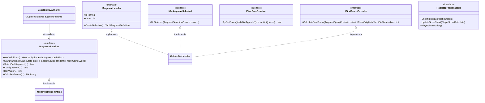

# Tessera SOLID 원칙 기반 리팩토링 작업 계획서 (AI 실행용)

## 1. 문서 목적 및 AI 클라이언트 작업 프로토콜

이 문서는 `Tessera` 프로젝트의 코드베이스에서 발견된 **SOLID 5대 원칙 위반 사항**을 점진적이고 안전하게 리팩토링하기 위한 실행 기준 계획서다.

본 문서는 사람이 직접 읽을 수도 있지만, **AI 코딩 에이전트/클라이언트가 독립적으로 한 태스크씩 읽고 코드를 직접 수정·검증할 수 있도록** 구체적인 인터페이스 명세, 대상 파일 및 라인 번호, Before/After 코드 예시, Unity 직렬화 보존 수칙, 테스트 검증 절차를 포함한다.

---

### 1.1 AI 클라이언트 작업 수칙 (Crucial Rules)

AI 클라이언트가 작업을 수행할 때는 다음 원칙을 반드시 준수해야 한다:

1. **단일 태스크 단위 수행 (One Task at a Time)**:
   - 한 번에 여러 태스크를 동시에 수정하지 않는다. 반드시 하나의 작업 ID(`SOLID-Txx`)만 선택하여 진행한다.
   - 작업 시작 전 `2. 현재 진행 포인터`의 해당 태스크 상태를 `DOING`으로 변경하고, 작업 완료 및 테스트 통과 후에만 `DONE`으로 갱신한다.
2. **정밀 수정 (Surgical Changes)**:
   - 지정된 파일과 관련된 인터페이스/클래스만 정확히 수정한다. 연관 없는 파일의 포맷을 바꾸거나 임의 리팩토링을 수행하지 않는다.
   - Microsoft C#/.NET 규약과 [`docs/coding_conventions.md`](coding_conventions.md)를 준수한다.
3. **Unity 직렬화 및 씬 무결성 절대 보존 (Zero Scene Breakage)**:
   - `MonoBehaviour` 컴포넌트의 `[SerializeField]` 필드명이나 타입을 변경하면 Unity 씬 및 프리팹 데이터가 유실된다.
   - 소품 분리(Phase 4) 시 기존 MonoBehaviour의 직렬화 필드는 그대로 유지하고, 내부 연산 로직(Mesh 생성 등)만 헬퍼/빌더 클래스로 분리 위임해야 한다.
4. **회귀 방지 및 단위 테스트 필수 통과**:
   - 수정 후 반드시 관련 NUnit 테스트(`Assets/Editor/Yacht*.cs`)가 손상되지 않는지 확인한다.
   - 룰셋이나 점수 계산 변경 시 `YachtGameRulesTests.cs`, 증강 변경 시 `Yacht*AugmentTests.cs`를 기준으로 일치성을 검증한다.
5. **언어 규약**:
   - 주석, 요약, 문서는 모두 **한국어**로 작성한다.

---

## 2. 현재 진행 포인터

| 항목 | 현재 값 |
|---|---|
| 전체 상태 | Phase 1 완료, Phase 2 진행 중 (`SOLID-T01`~`SOLID-T04` 완료, 8/12 남음) |
| 현재 마일스톤 | Phase 2: 룰셋 및 규칙 계층 LSP/ISP 정상화 |
| 현재 작업 | `SOLID-T05` 대기 중 |
| 다음 행동 | `SOLID-T05` 작업 착수 (`IYachtRuleSet` ISP 분리, `SelectPresetFile` 추출) |
| 차단 요소 | 없음 |
| 마지막 갱신일 | 2026-09-09 |

### 작업 상태 요약표

| 작업 ID | 단계 | 작업명 | 대상 파일 | 상태 |
|---|---|---|---|---|
| `SOLID-T01` | Phase 1 | 증강 획득 초기화 자율화 (`ApplyAugment` if-else 해소) | `YachtAugmentRuntime.cs`, 개별 `AugmentHandler` | `DONE` |
| `SOLID-T02` | Phase 1 | 증강 설명 및 메타데이터 일원화 (`Describe` switch 제거) | `YachtAugmentRuntime.cs`, `IAugmentHandler` | `DONE` |
| `SOLID-T03` | Phase 1 | 주사위 보너스 계산 OCP 준수 (`IDiceBonusProvider` 도입) | `YachtAugmentScoreEngine.cs`, `IAugmentHandler.cs` | `DONE` |
| `SOLID-T04` | Phase 1 | 주사위 면 결정 로직 분리 (`RollValue` switch 해소) | `YachtAugmentRuntime.cs`, 주사위 핸들러 | `DONE` |
| `SOLID-T05` | Phase 2 | `IYachtRuleSet` ISP 분리 (`SelectPresetFile` 추출) | `YachtGameCore.cs`, `IYachtRuleSet.cs` | `TODO` |
| `SOLID-T06` | Phase 2 | `AugmentedYachtRuleSet`의 LSP 계약 정상화 | `YachtGameCore.cs`, `YachtAugmentRuntime.cs` | `TODO` |
| `SOLID-T07` | Phase 2 | `YachtScoreCalculator` 가변 주사위 방어적 처리 | `YachtGameCore.cs` | `TODO` |
| `SOLID-T08` | Phase 3 | `LocalGameAuthority` DIP 개선 (`IAugmentRuntime` 도입) | `LocalGameAuthority.cs`, `YachtAugmentRuntime.cs` | `TODO` |
| `SOLID-T09` | Phase 3 | `YachtTurnFlowPresenter` 결합 완화 (`ITabletopPropsFacade`) | `YachtTurnFlowPresenter.cs`, 신규 파사드 | `TODO` |
| `SOLID-T10` | Phase 4 | `HourglassTimer` 지오메트리 빌더 분리 (SRP) | `HourglassTimer.cs`, `HourglassMeshBuilder.cs` | `TODO` |
| `SOLID-T11` | Phase 4 | `ParchmentScoreSheet` 지오메트리 빌더 분리 (SRP) | `ParchmentScoreSheet.cs`, `ParchmentMeshBuilder.cs` | `TODO` |
| `SOLID-T12` | Phase 4 | `RollOrb` 지오메트리 빌더 분리 (SRP) | `RollOrb.cs`, `RollOrbMeshBuilder.cs` | `TODO` |

---

## 3. SOLID 원칙 위반 진단 및 아키텍처 목표

### 3.1 진단 요약

```
[ 위반 사항 종합 ]
1. SRP (단일 책임 원칙)
   - YachtAugmentRuntime.cs (1,360 LOC): 카탈로그, 텍스트 설명, 드래프트 풀, 획득 처리, 주사위 면 굴림, 보너스 계산 등 6개 이상의 책임 집중.
   - Tabletop 소품 (Hourglass, Parchment, RollOrb): 수백 줄의 절차적 메시 생성 알고리즘과 런타임 렌더링/애니메이션, 인터랙션 로직 혼재.
   - YachtTurnFlowPresenter.cs (839 LOC): 11개의 뷰 컴포넌트를 직접 쥐고 스티커, VFX, 점수판, 셀 스타일을 일일이 명령.

2. OCP (개방-폐쇄 원칙)
   - YachtAugmentRuntime.ApplyAugment: 15개 이상의 증강에 대해 if-else 사다리로 상태 초기화 (신규 증강 추가 시 런타임 수정 필수).
   - YachtAugmentRuntime.Describe: 27개의 증강 설명을 switch문으로 하드코딩.
   - YachtAugmentScoreEngine.CalculateDiceBonus: 골든 다이스, 커플 다이스 등 특정 증강 ID를 if문으로 분기 검사.
   - YachtAugmentRuntime.RollValue: 주사위 타입(Heavy, Octahedron, Sevens 등)에 따른 면 값을 switch문으로 하드코딩.

3. LSP (리스코프 치환 원칙)
   - AugmentedYachtRuleSet: IYachtRuleSet을 구현하지만, 독자적인 증강 규칙을 계산하지 않고 NormalYachtRuleSet으로 무조건 우회 위임. 실질 계산은 ScoreEngine에서 이중 수행.
   - YachtScoreCalculator.Calculate: 주사위 배열 길이가 정확히 5개가 아니면 ArgumentException을 던져 가변 주사위(4개, 6개) 증강과 충돌 가능성 잠재.

4. ISP (인터페이스 분리 원칙)
   - IYachtRuleSet: 순수 게임 규칙 외에 뷰 프리셋 파일 경로 문자열을 반환하는 SelectPresetFile이 포함됨.

5. DIP (의존 역전 원칙)
   - LocalGameAuthority: 추상 인터페이스가 아닌 new YachtAugmentRuntime() 구체 인스턴스를 직접 생성 및 소유.
   - YachtTurnFlowPresenter: 구체 MonoBehaviour 클래스 11개를 직접 직렬화 참조하여 강결합.
```

### 3.2 개선 후 도달할 아키텍처



---

## 4. 단계별 태스크 상세 명세 (Work Cards)

---

### Phase 1: 증강 시스템 OCP/SRP 해소

#### `SOLID-T01`: 증강 획득 초기화 자율화 (`ApplyAugment` if-else 해소)
- **우선순위**: 최상 (P0)
- **원칙**: OCP, SRP
- **대상 파일**:
  - `Assets/Scripts/Games/AugmentedYacht/Logic/YachtAugmentRuntime.cs` (`ApplyAugment` 메서드 L1030-L1151, 사다리는 L1069-L1131)
  - `Assets/Scripts/Games/AugmentedYacht/Logic/Augments/Handlers/*.cs` (해당 증강 핸들러 파일들)
- **문제점 (Before)**:
  `YachtAugmentRuntime.ApplyAugment`에 11개의 증강 ID에 대한 상태 초기화 하드코딩 if-else 사다리가 존재함.
  ```csharp
  // YachtAugmentRuntime.cs L1069
  else if (augmentId == YachtBankId)
  {
      runtime.YachtBankRemainingTurns = 3;
      runtime.YachtBankBalance = 0;
      runtime.YachtBankPayoutPending = false;
      runtime.YachtBankPaid = false;
  }
  else if (augmentId == FastStraightId)
  {
      runtime.FastSmallScored = false;
      runtime.FastLargeScored = false;
      runtime.FastRewarded = false;
  }
  // ... NoTimeToWaste, StepByStep, Nozdormu, Momentum, PromotionDie, BountyHunter, Duel, Prophet, RandomBox 등 반복
  ```
  `GoldenDie`, `EquivalentExchange`, `Gambit`, `DoubleDown`, `PiggyBank`는 이미 `States` 딕셔너리 패턴을 써서 사다리 밖에 있었다(계획 수립 당시 서술 오류).
  실제로 확인해 보니 11개 분기 중 10개는 대응 핸들러의 `OnSelected`가 이미 같은 초기화를 중복 수행하고 있어 죽은 코드였다. 신규 작성이 필요했던 것은 `FastStraight` 하나뿐이었다.
- **개선 설계 (After)**:
  `IOnAugmentSelected` 디스패처는 착수 시점에 이미 구현돼 있었다(신규 작성 대상 아님). 각 증강 핸들러(`YachtBankHandler`, `FastStraightHandler` 등)에 `IOnAugmentSelected`를 구현시키고, `ApplyAugment`의 if-else 사다리를 제거하는 작업만 필요했다.
  ```csharp
  // 개별 핸들러 예시: YachtBankHandler.cs
  public sealed class YachtBankHandler : AugmentHandler, IOnAugmentSelected, IScoringDiceFilter
  {
      public override string Id => YachtAugmentRuntime.YachtBankId;
      // ...
      public void OnSelected(AugmentSelectionContext context)
      {
          var runtime = context.Player; // 또는 context.Game.AugmentPlayers[context.PlayerIndex]
          runtime.YachtBankRemainingTurns = 3;
          runtime.YachtBankBalance = 0;
          runtime.YachtBankPayoutPending = false;
          runtime.YachtBankPaid = false;
      }
  }

  // YachtAugmentRuntime.cs (기존 구현, 유지):
  // if-else 사다리만 전면 삭제, 디스패처 호출은 그대로 둠
  if (YachtAugmentCatalog.Find(augmentId) is IOnAugmentSelected selected)
  {
      var selection = new AugmentSelectionContext(state, playerIndex, random, events, replacement);
      selection.BindAugment(augmentId);
      selected.OnSelected(selection);
  }
  ```
- **작업 절차**:
  1. `ApplyAugment`에서 if-else로 분기 처리 중인 증강 목록 전수 확인: `YachtBank`, `FastStraight`, `NoTimeToWaste`, `StepByStep`, `Nozdormu`, `Momentum`, `PromotionDie`, `BountyHunter`, `Duel`, `Prophet`, `RandomBox`.
  2. 각 증강에 대응하는 `*Handler` 클래스를 찾아 `IOnAugmentSelected`를 구현하고 초기화 코드 이전. (실제로는 `FastStraight`를 제외한 10개는 핸들러가 이미 같은 초기화를 하고 있어 이관할 코드가 없었다.)
  3. `YachtAugmentRuntime.ApplyAugment`에서 해당 if-else 분기 블록을 안전하게 삭제.
  4. 변형 계열의 `ResetFilledTarget`은 공통 규칙이므로 `definition?.Kind == YachtAugmentKind.Modification` 분기로 유지한다. `ModificationAugment`의 XML 주석이 "카테고리 전체 규칙이라 `YachtAugmentRuntime`이 담당"이라고 설계 의도를 명시하고 있어, 변형 핸들러 공통 베이스로 위임하는 대안은 채택하지 않았다.
- **Unity 직렬화 영향도**: 없음 (순수 C# 로직).
- **검증 방법**:
  - `Assets/Editor/YachtQuestAugmentTests.cs`, `YachtEnhanceAugmentTests.cs`, `YachtManualActionAugmentTests.cs` 실행.

---

#### `SOLID-T02`: 증강 설명 및 메타데이터 일원화 (`Describe` switch 제거)
- **우선순위**: 상 (P1)
- **원칙**: OCP, SRP
- **대상 파일**:
  - `Assets/Scripts/Games/AugmentedYacht/Logic/YachtAugmentRuntime.cs` (L466-L496, L382-L411)
  - `Assets/Scripts/Games/AugmentedYacht/Logic/Augments/Core/IAugmentHandler.cs`
- **문제점 (Before)**:
  `YachtAugmentRuntime.cs`에 27개 증강의 한국어 설명 텍스트가 거대한 `Describe(string id) => id switch { ... }`로 하드코딩되어 있음. 신규 증강 추가 시 핸들러 외에 런타임 파일까지 수정해야 함.
  실제로 확인해 보니 인용한 라인 범위(`Describe` L466-496, `Definitions` L382-411)는 실제 코드와 정확히 일치했다. 레거시 `Definitions`/`Describe`가 다루던 증강은 27개였고, 이는 `YachtAugmentCatalog`에 등록된 45개 핸들러 ID의 완전한 부분집합이었다. 카탈로그에만 있는 변형(Modification) 계열 18종은 레거시 쪽에 아예 없었다. 또한 `BuildAllDefinitions()`의 레거시 순회 조건이 `YachtAugmentCatalog.Find(id) == null`이었으므로 27개 전부에 대해 거짓이 되어, 레거시 `Definitions`/`Describe`는 착수 이전부터 이미 결과가 버려지는 죽은 코드였다.
- **개선 설계 (After)**:
  모든 증강 정의는 각 증강의 `IAugmentHandler.CreateDefinition()`에서 일원화하여 생성하도록 확정.
  아직 핸들러가 없는 증강이 있다면 핸들러를 추가하거나, 카탈로그 빌더를 통해 생성하도록 리팩토링.
  ```csharp
  // YachtAugmentRuntime.cs에서 Describe() 메서드 완전 제거
  // YachtAugmentDefinition은 핸들러가 제공하는 CreateDefinition()에 완전히 위임
  ```
- **작업 절차**:
  1. `YachtAugmentCatalog`에 등록된 핸들러와 `Definitions` 배열에만 남아있는 증강 목록 비교.
  2. 남아있는 레거시 증강들을 정식 `IAugmentHandler` 구현체로 완결(이미 대부분 구현되어 있으므로 설명 문자열을 핸들러의 `CreateDefinition()`으로 통합).
  3. `YachtAugmentRuntime.cs`의 `Describe()` switch문 및 레거시 `Definitions` 배열 삭제.
  4. `AllDefinitions`를 `YachtAugmentCatalog.All.Select(h => h.CreateDefinition()).ToArray()`로 단순화.
  실제로 확인해 보니 각 카테고리 베이스(`EnhanceAugment`, `QuestAugment`, `ModificationAugment`)가 이미 `CreateDefinition()`에서 하위 클래스의 `Description` 프로퍼티 값을 채우고 있어, 실사용 설명 텍스트는 착수 이전부터 이미 핸들러 쪽 값이었다. 절차 1·2(핸들러 없는 증강 보완)는 이미 충족돼 있었고, 실제로 필요했던 것은 절차 3·4(삭제와 단순화)뿐이었다.
- **Unity 직렬화 영향도**: 없음.
- **검증 방법**:
  - `YachtGameRulesTests.cs`, `AugmentRuntime_SeparatesStaticDefinitionFromPlayerState()` 실행, 드래프트 카드 툴팁 설명이 정상 출력되는지 검증.
  실제로 확인해 보니 계획서가 인용한 `AugmentMigrationTests`는 존재하지 않았다. 45개 증강 무결성 검증은 `Assets/Editor/YachtGameRulesTests.cs`의 `AugmentRuntime_SeparatesStaticDefinitionFromPlayerState()`가 담당하며, 정의 45개·첫 항목이 `LuckySevensId`(카탈로그 순서 의존)·`StepByStep`의 `PhaseOneOnly`·`LuckySevens`의 `DisplayName`을 단정한다. 설명 텍스트 내용 자체는 검사하지 않는다.
- **실제 수행한 변경** (`YachtAugmentRuntime.cs` 단일 파일, 순증감 +2 -105줄):
  레거시 `Definitions` 정적 배열, `Describe(string id)` switch 메서드, `Definitions` 생성 전용 private static 헬퍼 4개(`Quest`, `Dice`, `Action`, `Enhance`)를 삭제했다. 넷 다 `private static`이라 외부 호출이 구조적으로 불가능했고 파일 내 호출처도 삭제 대상뿐이었다. `BuildAllDefinitions()`에서는 레거시 순회를 제거하고 `YachtAugmentCatalog.All` 순회만 남겼으며, 카탈로그 등록 순서와 `GetDefinitions()`/`Lookup`의 `Clone()` 호출은 그대로 보존했다. 45개 증강 ID 상수는 모든 핸들러가 참조하므로 유지했고, 이 때문에 핸들러들의 `YachtAugmentRuntime` 의존은 T02 이후에도 남는다. 레거시 `Describe()` 텍스트 중 일부는 핸들러 값과 내용이 달랐다(예: `WeightedDice`). 실사용은 핸들러 값이었으므로 stale 텍스트가 사라지는 것이 올바른 방향이었다.
- **검증 결과**: 컴파일 통과, 새 경고 없음. EditMode 전체 884개 중 통과 874, 실패 5, 스킵 5. 핵심 회귀 테스트 `AugmentRuntime_SeparatesStaticDefinitionFromPlayerState()` 통과. 실패 중 `UnitySkills.Tests.Core` 2건은 저장소 무관 상시 실패로 제외. 나머지 3건(`FontFallbackTests` 2건, `YachtGameRulesTests.LuckySevens_MidGameAcquisitionResetsOnlyOwnerAcesAndGrantsExtraTurn` 1건)은 이번 변경과 무관함을 확인했다.
- **후속 과제**: `LuckySevens_MidGameAcquisitionResetsOnlyOwnerAcesAndGrantsExtraTurn` 실패는 T01·T02 변경을 `git stash`로 되돌린 베이스라인에서도 동일하게 재현되어 T02 범위 밖의 기존 결함으로 확인됐다. `DetermineFirstDraftPlayer`는 총점이 낮은 쪽을 선공으로 정하는데, 해당 테스트는 `TrySelectAugment`에 `playerIndex=0`을 하드코딩해 드래프트 선공 가드에 걸리는 것으로 분석됨(`YachtGameRulesTests.cs:270`). 별도 태스크로 분리해 수정 필요.
  **(2026-09-09 해결)** `git log`·`git blame`으로 시간 순서를 확인한 결과, 이 테스트는 `18500e95`(2026-08-25)에 작성됐고 드래프트 선공 규칙은 그보다 2주 뒤인 `ecc0f896`(2026-09-08)에 신설됐다. 선공 규칙은 `docs/augmented_yacht_work_plan.md`의 결정 기록 `D-039`에 "앞선 쪽이 계속 먼저 골라 격차가 누적되므로 뒤처진 쪽에 우선권을 준다"는 근거까지 명시된 의도된 사양이므로 프로덕션 로직이 옳고 테스트가 낡은 쪽이었다. 규칙을 도입한 커밋 메시지에도 "Unity Test Runner 미실행"이라고 적혀 있어 그 시점부터 회귀가 방치된 것으로 보인다.
  수정은 테스트 한 건에 한정했다. 두 플레이어의 에이스 칸 점수를 뒤집어(플레이어 0을 4에서 2로, 플레이어 1을 2에서 4로) 총점이 낮은 플레이어 0이 선공이 되게 하고, `TryBeginDraft` 직후 `state.Draft.PlayerIndex`가 0인지 단정하는 줄을 추가해 선공 전제를 명시화했다. 이 단정은 `YachtDraftOrderTests`의 기존 관용구를 따른 것으로, 향후 선공 규칙이 다시 바뀌면 엉뚱한 위치가 아니라 이 줄에서 먼저 드러난다. 상대 칸 유지를 보는 단정의 기대값만 4로 맞췄고 보유자 에이스 초기화·추가 턴·3배 배율 단정은 원본 그대로 두었다. EditMode 전체 886개 재실행 결과 이 테스트가 통과하고 `YachtDraftOrderTests` 5건도 전부 통과해, 프로젝트 관련 미해결 실패는 폰트 에셋 문제 2건만 남았다.

---

#### `SOLID-T03`: 주사위 보너스 계산 OCP 준수 (`IDiceBonusProvider` 도입)
- **우선순위**: 상 (P1)
- **원칙**: OCP, ISP
- **대상 파일**:
  - `Assets/Scripts/Games/AugmentedYacht/Logic/Augments/Core/IAugmentHandler.cs` (인터페이스 추가)
  - `Assets/Scripts/Games/AugmentedYacht/Logic/YachtAugmentScoreEngine.cs` (L37-L54)
  - `Assets/Scripts/Games/AugmentedYacht/Logic/Augments/Handlers/GoldenDieHandler.cs` (또는 해당 핸들러)
  - `Assets/Scripts/Games/AugmentedYacht/Logic/Augments/Handlers/CoupleDiceHandler.cs`
- **문제점 (Before)**:
  `YachtAugmentScoreEngine.CalculateDiceBonus`에서 `GoldenDieId`와 `CoupleDiceId`를 하드코딩 if문으로 검사하여 보너스를 산출함.
  ```csharp
  public static int CalculateDiceBonus(YachtGameState state, int playerIndex, IReadOnlyList<YachtDieState> dice)
  {
      // ...
      if (Contains(player.OwnedIds, YachtAugmentRuntime.GoldenDieId)) { ... }
      if (Contains(player.OwnedIds, YachtAugmentRuntime.CoupleDiceId)) { ... }
  }
  ```
  실제로 확인해 보니 `CalculateDiceBonus`는 `GoldenDieId`/`CoupleDiceId` 같은 증강 ID 문자열을 전혀 비교하지 않았다. 실제로는 `YachtDieState.Type`의 enum 값(`YachtDieType.Golden`, `YachtDieType.Couple`)을 직접 검사하는 방식이었다. 또한 계획서가 가정한 시그니처 `CalculateDiceBonus(YachtGameState state, int playerIndex, IReadOnlyList<YachtDieState> dice)`와 달리, 실제 메서드는 주사위 목록 하나만 받는 `CalculateDiceBonus(IReadOnlyList<YachtDieState> dice)`였다. 디스패처로 수집하려면 게임 상태와 플레이어 인덱스가 필요해 시그니처 변경이 불가피했다. 계획서가 적은 핸들러 경로 `Augments/Handlers/GoldenDieHandler.cs`, `CoupleDiceHandler.cs`도 존재하지 않았다. 실제 파일은 `Augments/Enhance/GoldenDie.cs`, `Augments/Enhance/CoupleDice.cs`이며 클래스명도 `Handler` 접미사가 없다. 계획서 대상 파일 목록에는 없었지만 `Assets/Editor/YachtEnhanceAugmentTests.cs`의 테스트 두 건이 `CalculateDiceBonus`를 직접 호출하고 있어 시그니처 변경에 따라 호출부 수정이 필요했다. 사용자 확인을 거쳐 엔진 메서드를 유지하고 테스트 호출부를 고치는 범위로 진행했다.
- **개선 설계 (After)**:
  `IDiceBonusProvider` 인터페이스를 선언하고, `YachtAugmentDispatcher.Collect<IDiceBonusProvider>`를 통해 주사위 보너스를 동적으로 합산하도록 변경.
  ```csharp
  // IAugmentHandler.cs
  public interface IDiceBonusProvider
  {
      int CalculateDiceBonus(AugmentQueryContext context, IReadOnlyList<YachtDieState> dice);
  }

  // GoldenDieHandler.cs
  public sealed class GoldenDieHandler : AugmentHandler, IDiceBonusProvider, ...
  {
      public int CalculateDiceBonus(AugmentQueryContext context, IReadOnlyList<YachtDieState> dice)
      {
          // 황금 주사위 보너스 연산 (+2점)
      }
  }

  // YachtAugmentScoreEngine.cs
  public static int CalculateDiceBonus(YachtGameState state, int playerIndex, IReadOnlyList<YachtDieState> dice)
  {
      var context = new AugmentQueryContext(state, playerIndex);
      List<IDiceBonusProvider> providers = YachtAugmentDispatcher.Collect<IDiceBonusProvider>(state, playerIndex);
      int bonus = 0;
      for (int i = 0; i < providers.Count; i++)
      {
          context.BindAugment(((IAugmentHandler)providers[i]).Id);
          bonus += providers[i].CalculateDiceBonus(context, dice);
      }
      return bonus;
  }
  ```
- **작업 절차**:
  1. `IAugmentHandler.cs`에 `IDiceBonusProvider` 인터페이스 선언.
  2. `GoldenDieHandler` 및 `CoupleDiceHandler`에 `IDiceBonusProvider` 인터페이스 구현.
  3. `YachtAugmentScoreEngine.CalculateDiceBonus`의 하드코딩 ID 체크를 디스패처 수집 방식으로 교체.
- **Unity 직렬화 영향도**: 없음.
- **검증 방법**:
  - `YachtEnhanceAugmentTests.cs` (황금 주사위, 커플 주사위 보너스 점수 테스트) 실행.
- **실제 수행한 변경** (6개 파일):
  - `Augments/Core/IAugmentHandler.cs`: `IDiceBonusProvider` 인터페이스를 `IScoreEnhancementModifier` 직후에 선언. 시그니처는 `int CalculateDiceBonus(AugmentQueryContext context, IReadOnlyList<YachtDieState> dice)`로, 같은 파일의 `IScoringDiceFilter` 선례와 형태를 맞췄다.
  - `Augments/Enhance/GoldenDie.cs`: `IDiceBonusProvider` 구현 추가. `YachtDieType.Golden`이면서 눈이 1~3인 주사위마다 2점.
  - `Augments/Enhance/CoupleDice.cs`: `IDiceBonusProvider` 구현 추가. `YachtDieType.Couple`이 정확히 2개이고 눈이 모두 같을 때만 3점.
  - `YachtAugmentScoreEngine.cs`: `CalculateDiceBonus` 시그니처를 `(YachtGameState, int, IReadOnlyList<YachtDieState>)`로 바꾸고 본문을 `YachtAugmentDispatcher.Collect<IDiceBonusProvider>` 수집·합산으로 교체. Golden/Couple 하드코딩 분기와 지역 변수 삭제.
  - `YachtAugmentRuntime.cs` (`CreateScoreCandidates` 내부): 호출부에 `state`, `playerIndex` 인자 추가.
  - `Assets/Editor/YachtEnhanceAugmentTests.cs`: 호출 4곳의 인자만 새 시그니처에 맞춤. 기대 점수 값(2, 0, 3, 0)과 테스트 구조는 그대로 유지해 리팩토링 전후 동작 동일성을 검증했다.
- **설계 근거**: 이 저장소에는 `Collect<T>`로 여러 구현체 결과를 합산하는 선례가 이미 있었다. `YachtAugmentRuntime.CreateScoreCandidates` 안의 `IScoreEnhancementModifier` 수집 코드와 `IBeforeScorePreview` 수집 코드다. 새 패턴을 만들지 않고 그 형태(컨텍스트 생성 → `Collect<T>` → for 순회 → `BindAugment` → 개별 호출)를 그대로 따랐다. `YachtAugmentDispatcher.Collect<T>`는 `Order` 우선, 동률이면 카탈로그 등록 순으로 정렬해 반환하므로 합산 순서가 결정적이다.
- **검증 결과**: 컴파일 통과, 새 경고 없음. EditMode 전체 884개 실행. 핵심 회귀 3건 모두 통과: `GoldenDice_AssignsOneSlotToGoldenAndGivesTwoPointBonusOnOneToThree()`, `CoupleDice_AssignsTwoSlotsAndGivesThreePointBonusOnMatch()`, `M6_AppliesEnhanceMultiplierThenDiceBonusAndScratchStaysZero()`. Tessera 관련 실패는 `SOLID-T02` 시점에 확인된 기존 3건 그대로이며 새로 생긴 회귀는 없다.
- **후속 과제**: `GoldenDie`와 `CoupleDice` 클래스의 기존 XML 주석이 실제 점수와 달랐다. 주석은 각각 "6으로 득점 시 +3점", "같으면 +5점"이라 적혀 있었으나 실제 로직과 테스트는 눈 1~3일 때 +2점, 커플 일치 시 +3점이다. 사용자 확인 결과 **코드 쪽 점수(+2점, +3점)가 의도한 사양**으로 확정되어, 두 클래스의 XML 주석과 게임 내 표시용 `Description` 문자열을 실제 로직에 맞게 정정했다. `Description` 텍스트를 단정하는 테스트는 없어 회귀 영향 없음.

---

#### `SOLID-T04`: 주사위 면 결정 로직 분리 (`RollValue` switch 해소)
- **우선순위**: 보통 (P2)
- **원칙**: OCP, SRP
- **대상 파일**:
  - `Assets/Scripts/Games/AugmentedYacht/Logic/YachtAugmentRuntime.cs` (L660-L671)
  - `Assets/Scripts/Dice/` 또는 `Assets/Scripts/Games/AugmentedYacht/Logic/` (신규 헬퍼)
- **문제점 (Before)**:
  `YachtAugmentRuntime.RollValue`에 각 주사위 타입(`Heavy`, `Octahedron`, `Sevens`, `Promotion`)의 면 배열 구성이 switch 식으로 고정되어 있음.
- **개선 설계 (After)**:
  주사위 타입별 눈면 정의를 주사위 도메인 객체(`YachtDieDefinition` 또는 `DiceFaceTable`)로 분리하거나, `IDiceFaceResolver`를 도입하여 런타임에서 주사위 눈면 데이터 테이블을 조회하도록 변경.
  ```csharp
  public static class YachtDieFaces
  {
      private static readonly Dictionary<YachtDieType, int[]> FaceMap = new()
      {
          [YachtDieType.Heavy] = new[] { 4, 4, 5, 5, 6, 6 },
          [YachtDieType.Octahedron] = new[] { 1, 2, 3, 4, 4, 5, 5, 6 },
          [YachtDieType.Sevens] = new[] { 2, 3, 4, 5, 6, 7 }
      };

      public static bool TryGetFaces(YachtDieType type, out int[] faces) =>
          FaceMap.TryGetValue(type, out faces);
  }
  ```
- **작업 절차**:
  1. 주사위 눈면 데이터를 전담하는 정적 클래스 또는 매핑 테이블 추출.
  2. `YachtAugmentRuntime.RollValue`가 해당 테이블을 참조하도록 단순화.
- **Unity 직렬화 영향도**: 없음.
- **검증 방법**:
  - `DiceFaceValueTests.cs`, `OctahedronOrientationTests.cs` 실행.
  실제로 확인해 보니 이 두 파일 모두 `YachtAugmentRuntime.RollValue`를 호출하지 않았다. `OctahedronOrientationTests`는 물리 회전 계산과 프리셋 슬롯 순서만 다뤄 주제가 무관했다. `DiceFaceValueTests`는 시각용 면 매핑을 다루면서, 굴림 표와 같은 값을 테스트 파일 안에 다시 하드코딩한 `RuleValuesOf` 미러 헬퍼를 갖고 있었을 뿐이다. 착수 시점 `RollValue`의 실제 회귀 방어선은 `YachtEnhanceAugmentTests.cs`의 무거운 주사위·세븐스 주사위 굴림 테스트 두 건뿐이었고, 팔면체와 승급 주사위는 굴림 검증이 없었다. 또한 계획서는 `Heavy`, `Octahedron`, `Sevens`, `Promotion` 네 타입을 모두 면 배열 테이블로 추출할 수 있는 것처럼 서술했으나, `Promotion`은 면 배열이 아니라 주사위별 상태인 `YachtDieState.PromotionLevel`을 그대로 반환하며 난수도 쓰지 않는다. 정적 데이터 테이블로 표현할 수 없어 기존 분기를 유지했다. 면 배열 리터럴은 굴림 로직, `Assets/Scripts/Dice/DiceFaceValues.cs`, 위 테스트 미러 세 곳에 중복돼 있었으나, `DiceFaceValues`는 키가 `DieType`(시각용 열거형)이고 목적이 물리 면 인덱스 조회라 `YachtDieType` 기반 굴림 표와 통합할 수 없어 손대지 않았다.
- **작업 범위 판단**: 계획서 대상 파일 목록에 테스트가 없었으나, 미러 테이블 중복 제거와 검증 공백 보강을 포함할지 사용자에게 확인해 "테이블 추출 + 중복 제거 + 테스트 보강" 범위로 진행했다.
- **실제 수행한 변경** (4개 파일):
  - 신규 `Assets/Scripts/Games/AugmentedYacht/Logic/YachtDieFaces.cs`: `TryGetFaces(YachtDieType type, out int[] faces)` 하나만 공개하는 정적 클래스. 내부는 `Dictionary<YachtDieType, int[]>`이며 `Heavy`, `Octahedron`, `Sevens` 세 항목만 담는다. 클래스 주석에 이 표가 굴림 결과 생성용이며 `DiceFaceValues`의 시각용 매핑과 별개 체계임을 명시했다.
  - `YachtAugmentRuntime.RollValue`: switch 식을 제거하고 승급 분기를 맨 앞으로 옮긴 뒤 나머지를 테이블 조회로 대체. 시그니처와 동작은 불변이며, 표에 없는 타입(`Normal`, `Golden`, `Weird`, `Couple`)이 `baseRoll()`로 떨어지는 것도 그대로다.
  - `Assets/Editor/DiceFaceValueTests.cs`: `RuleValuesOf` 헬퍼의 하드코딩 미러 테이블을 새 테이블 조회로 교체하고 폴백만 남겼다. 승급 주사위는 표에 없어 폴백 경로를 타므로 기존과 같은 기본 눈금을 반환한다. 이 헬퍼를 쓰는 테스트의 단정과 기대값은 바꾸지 않았다.
  - `Assets/Editor/YachtEnhanceAugmentTests.cs`: 검증 공백을 메우는 테스트 두 건 추가. 팔면체 주사위의 굴림값이 면 배열 안에서만 나오는지, 승급 주사위가 난수와 무관하게 승급 레벨을 그대로 돌려주는지 단정한다. 기존 테스트는 수정하지 않았다.
- **검증 결과**: 컴파일 통과, 새 경고 없음. 신규 파일의 `.meta`는 Unity 에셋 갱신으로 생성됐다. EditMode 전체 886개 실행(신규 2건 반영). 핵심 테스트 전부 통과: 무거운 주사위·세븐스 주사위 기존 굴림 테스트 2건, 신규 팔면체·승급 주사위 테스트 2건, `DiceFaceValueTests` 전체. Tessera 관련 실패는 `SOLID-T02` 시점에 확인된 기존 3건 그대로이며 새로 생긴 회귀는 없다.

Phase 1(증강 시스템 OCP/SRP 해소)의 `SOLID-T01`~`SOLID-T04` 네 태스크가 모두 완료됐다. 다음은 Phase 2(룰셋 및 규칙 계층 LSP/ISP 정상화), 첫 작업은 `SOLID-T05`다.

---

### Phase 2: 룰셋 및 규칙 계층 LSP/ISP 정상화

#### `SOLID-T05`: `IYachtRuleSet` ISP 분리 (`SelectPresetFile` 추출)
- **우선순위**: 상 (P1)
- **원칙**: ISP
- **대상 파일**:
  - `Assets/Scripts/Games/Yacht/YachtGameCore.cs` (L393-L435)
  - `Assets/Scripts/Games/AugmentedYacht/Logic/YachtAugmentRuntime.cs` (L685-L698)
- **문제점 (Before)**:
  `IYachtRuleSet` 인터페이스는 순수한 게임 규칙(점수 계산, 카테고리 목록 등)을 다루어야 하지만, 뷰 프리셋 파일명 문자열을 반환하는 `SelectPresetFile` 메서드가 포함되어 있음.
  ```csharp
  public interface IYachtRuleSet
  {
      string Name { get; }
      IReadOnlyList<ScoreCategory> ScorableCategories { get; }
      Dictionary<ScoreCategory, int> CalculatePreviewScores(IReadOnlyList<YachtDieState> dice);
      string SelectPresetFile(IReadOnlyList<YachtDieState> dice, bool tableFlip); // <-- 뷰/에셋 로딩 관심사 침범!
  }
  ```
- **개선 설계 (After)**:
  `SelectPresetFile`을 별도의 인터페이스인 `IDicePresetResolver`로 분리. `IYachtRuleSet`은 순수 게임 로직만 담당.
  ```csharp
  public interface IDicePresetResolver
  {
      string SelectPresetFile(IReadOnlyList<YachtDieState> dice, bool tableFlip);
  }

  public interface IYachtRuleSet
  {
      string Name { get; }
      IReadOnlyList<ScoreCategory> ScorableCategories { get; }
      Dictionary<ScoreCategory, int> CalculatePreviewScores(IReadOnlyList<YachtDieState> dice);
  }
  ```
- **작업 절차**:
  1. `IDicePresetResolver` 인터페이스 정의.
  2. 프리셋 파일 선택이 필요한 프레젠터/컨트롤러에서 `IDicePresetResolver`를 주입받아 사용.
  3. `IYachtRuleSet`에서 `SelectPresetFile` 제거 및 `NormalYachtRuleSet`, `AugmentedYachtRuleSet` 수정.
- **Unity 직렬화 영향도**: 없음.
- **검증 방법**:
  - `YachtGameRulesTests.cs`, `DicePresetBakeTests.cs` 실행.

---

#### `SOLID-T06`: `AugmentedYachtRuleSet`의 LSP 계약 정상화
- **우선순위**: 중 (P2)
- **원칙**: LSP
- **대상 파일**:
  - `Assets/Scripts/Games/Yacht/YachtGameCore.cs` (L420-L435)
  - `Assets/Scripts/Games/AugmentedYacht/Logic/YachtAugmentRuntime.cs`
- **문제점 (Before)**:
  `AugmentedYachtRuleSet`이 `IYachtRuleSet`을 상속하지만, `CalculatePreviewScores` 호출 시 증강 상태(`YachtGameState`)가 없어 실제 증강 점수(변형 족보 등)를 계산하지 못하고 기본 룰(`NormalYachtRuleSet`)로 무조건 위임함. 따라서 `IYachtRuleSet`으로 치환했을 때 예상과 다른 기본 점수가 반환되는 LSP 위반 발생.
- **개선 설계 (After)**:
  1. 규칙 인터페이스에 컨텍스트를 지원하는 오버로드(`CalculatePreviewScores(IReadOnlyList<YachtDieState> dice, YachtGameState state = null, int playerIndex = -1)`)를 도입하거나,
  2. `AugmentedYachtRuleSet`이 런타임 상태 공급자(`Func<YachtGameState>`)를 주입받아 증강 점수를 온전히 계산하도록 구현하여 진정한 증강 룰셋으로 기능하도록 수정.
- **작업 절차**:
  1. `AugmentedYachtRuleSet` 생성 시 런타임 또는 상태 컨텍스트를 연결할 수 있는 구조 마련.
  2. 컨텍스트가 주어지면 `YachtAugmentRuntime.CalculateScores`를 정확히 호출하여 증강 족보가 반영된 점수 딕셔너리를 반환하도록 보완.
- **Unity 직렬화 영향도**: 없음.
- **검증 방법**:
  - `YachtGameRulesTests.cs`에서 `AugmentedYachtRuleSet` 치환 시 변형 족보(예: Evens, Mountain) 점수가 정상 계산되는지 테스트.

---

#### `SOLID-T07`: `YachtScoreCalculator` 가변 주사위 방어적 처리
- **우선순위**: 보통 (P2)
- **원칙**: LSP
- **대상 파일**:
  - `Assets/Scripts/Games/Yacht/YachtGameCore.cs` (L23-L28)
- **문제점 (Before)**:
  ```csharp
  if (dice == null || dice.Length != 5)
      throw new ArgumentException("Yacht score requires exactly 5 dice.", nameof(dice));
  ```
  증강 모드에서는 갬빗(`Gambit`)으로 4개 또는 6개 주사위를 굴리거나, 요트 뱅크(`YachtBank`)로 4개 주사위만 점수 계산에 쓰이는 경우가 있음. 이로 인해 주사위 수가 5개가 아닐 때 예외가 발생할 위험이 존재함.
- **개선 설계 (After)**:
  주사위 개수 불변식을 5개 고정이 아닌 1개 이상의 가변 개수(`dice.Length >= 1`)를 지원하도록 완화하고, 상단 점수 및 족보 판정(Three of a kind, Full House 등)을 일반화된 카운팅 알고리즘으로 안전하게 계산.
- **작업 절차**:
  1. `YachtScoreCalculator.Calculate`의 검증부를 가변 주사위 길이 허용으로 변경.
  2. 5개 미만/초과 주사위 전달 시 족보 계산 알고리즘 검증(기존 `scoreEngine.test.mjs` 및 M6 기준과 일치).
- **Unity 직렬화 영향도**: 없음.
- **검증 방법**:
  - `YachtGameRulesTests.cs`에 4개 및 6개 주사위 입력 테스트 케이스 추가 후 검증.

---

### Phase 3: 권위 및 프레젠테이션 계층 DIP 개선

#### `SOLID-T08`: `LocalGameAuthority` DIP 개선 (`IAugmentRuntime` 도입)
- **우선순위**: 상 (P1)
- **원칙**: DIP
- **대상 파일**:
  - `Assets/Scripts/Games/Yacht/LocalGameAuthority.cs` (L13, L88-L99)
  - `Assets/Scripts/Games/AugmentedYacht/Logic/YachtAugmentRuntime.cs`
  - 신규 인터페이스: `Assets/Scripts/Games/AugmentedYacht/Logic/IAugmentRuntime.cs`
- **문제점 (Before)**:
  `LocalGameAuthority`가 구체 클래스 `new YachtAugmentRuntime()`에 직접 강결합되어 있어 모의 객체(Mock)를 통한 게임 권위 단위 테스트가 어렵고 결합도가 높음.
- **개선 설계 (After)**:
  `IAugmentRuntime` 인터페이스를 정의하고, `LocalGameAuthority`가 생성자나 프로퍼티를 통해 `IAugmentRuntime`을 주입받을 수 있도록 변경(기본값은 `new YachtAugmentRuntime()`).
  ```csharp
  public interface IAugmentRuntime
  {
      IReadOnlyList<YachtAugmentDefinition> GetDefinitions();
      YachtGameEvent[] StartDraft(YachtGameState state, IRandomSource random, IRandomSource visualRandom = null);
      bool SelectDraftAugment(YachtGameState state, int playerIndex, string augmentId, IRandomSource random, IRandomSource visualRandom, out YachtGameEvent[] events, out YachtCommandErrorCode errorCode, out string errorMessage);
      void ConfigureDice(YachtGameState state, int playerIndex, YachtDieState[] dice);
      int RollValue(YachtDieState die, IRandomSource random, Func<int> baseRoll);
      int GetDiceCount(YachtGameState state, int playerIndex, int defaultCount);
      Dictionary<ScoreCategory, int> CalculateScores(YachtGameState state, int playerIndex, IReadOnlyList<YachtDieState> dice);
  }

  public sealed class LocalGameAuthority : IGameAuthority
  {
      private readonly IAugmentRuntime augmentRuntime;

      public LocalGameAuthority(YachtGameOptions options, IAugmentRuntime augmentRuntime = null)
      {
          this.augmentRuntime = augmentRuntime ?? (options.AugmentMode ? new YachtAugmentRuntime() : null);
      }
  }
  ```
- **작업 절차**:
  1. `IAugmentRuntime` 인터페이스 파일 생성.
  2. `YachtAugmentRuntime`이 `IAugmentRuntime`을 구현하도록 선언.
  3. `LocalGameAuthority`의 필드 타입을 `IAugmentRuntime`으로 교체하고 선택적 생성자 주입 지원.
- **Unity 직렬화 영향도**: 없음.
- **검증 방법**:
  - 모의 `IAugmentRuntime`을 사용한 `LocalGameAuthority` 독립 단위 테스트 작성 및 통과 확인.

---

#### `SOLID-T09`: `YachtTurnFlowPresenter` 결합 완화 (`ITabletopPropsFacade`)
- **우선순위**: 보통 (P2)
- **원칙**: DIP, SRP
- **대상 파일**:
  - `Assets/Scripts/Games/AugmentedYacht/Presentation/YachtTurnFlowPresenter.cs` (L21-L160)
  - 신규 파사드: `Assets/Scripts/Games/AugmentedYacht/Presentation/TabletopPropsFacade.cs`
- **문제점 (Before)**:
  `YachtTurnFlowPresenter`가 11개의 서로 다른 테이블탑 소품(`ParchmentScoreSheet`, `HourglassTimer`, `RollOrb`, `DiceCup`, `AugmentDraftCardPresenter`, `AugmentStickerPresenter` 등)을 직접 들고 수동 제어하고 있어 840줄에 달하는 과도한 오케스트레이션 책임이 집중됨.
- **개선 설계 (After)**:
  테이블탑 소품과의 연출 상호작용을 묶어주는 파사드 객체(`ITabletopPropsFacade`)를 도입하거나, 역할별 연출 인터페이스(`ITurnTimerView`, `IScoreSheetView`, `IRollInputView`)로 분리.
- **작업 절차**:
  1. 프레젠터가 소품 컴포넌트에 직접 호출하는 메서드 패턴 분석.
  2. 소품 연출을 통합 전달하는 `TabletopPropsFacade` 컴포넌트 생성.
  3. `YachtTurnFlowPresenter`가 개별 소품 대신 파사드를 통해 연출을 지시하도록 단순화.
- **Unity 직렬화 영향도**:
  - **주의**: 기존 `YachtTurnFlowPresenter`의 `[SerializeField]` 필드를 제거하면 씬 바인딩이 깨질 수 있으므로, 기존 필드는 유지하면서 내부 연결을 파사드로 위임하는 래퍼 방식으로 안전하게 진행.
- **검증 방법**:
  - `Assets/Scenes/Augmented Dice.unity` 실행 및 턴 진행 연출 정상 동작 확인.

---

### Phase 4: 테이블탑 소품 컴포넌트 SRP 분리

#### `SOLID-T10`: `HourglassTimer` 지오메트리 빌더 분리 (SRP)
- **우선순위**: 보통 (P2)
- **원칙**: SRP
- **대상 파일**:
  - `Assets/Scripts/Tabletop/HourglassTimer.cs` (787 LOC)
  - 신규 파일: `Assets/Scripts/Tabletop/HourglassMeshBuilder.cs`
- **문제점 (Before)**:
  `HourglassTimer.cs` 안에 모래시계 목재 프레임, 유리 벌브, 모래 입자 등의 절차적 메시를 삼각함수로 빌드하는 순수 지오메트리 코드 수백 줄과 런타임 타이머 로직 및 모래 낙하 셰이더 프로퍼티 제어 로직이 결합되어 있음.
- **개선 설계 (After)**:
  메시 생성 연산만 정적 유틸리티 클래스 `HourglassMeshBuilder`로 분리.
  `HourglassTimer.cs`는 빌더가 반환한 `Mesh`를 `MeshFilter`에 할당받고, 게임 틱에 따른 회전 및 모래 흐름 연출에만 집중.
  ```csharp
  // 신규: HourglassMeshBuilder.cs
  public static class HourglassMeshBuilder
  {
      public static Mesh BuildGlassBulbMesh(HourglassBulbSettings settings) { ... }
      public static Mesh BuildWoodFrameMesh(HourglassFrameSettings settings) { ... }
  }

  // HourglassTimer.cs
  private void BuildProceduralMeshes()
  {
      bulbFilter.sharedMesh = HourglassMeshBuilder.BuildGlassBulbMesh(...);
      frameFilter.sharedMesh = HourglassMeshBuilder.BuildWoodFrameMesh(...);
  }
  ```
- **작업 절차**:
  1. `HourglassTimer.cs`에서 순수 버텍스/인덱스 연산 메서드들을 식별하여 `HourglassMeshBuilder`로 추출.
  2. `HourglassTimer`의 직렬화 필드는 전혀 손대지 않고, 호출만 빌더로 위임.
- **Unity 직렬화 영향도**: 없음 (`SerializeField` 필드 유지).
- **검증 방법**:
  - `TurnBalanceIndicatorTests.cs` 실행 및 씬에서 모래시계 렌더링 확인.

---

#### `SOLID-T11`: `ParchmentScoreSheet` 지오메트리 빌더 분리 (SRP)
- **우선순위**: 보통 (P2)
- **원칙**: SRP
- **대상 파일**:
  - `Assets/Scripts/Tabletop/ParchmentScoreSheet.cs` (1,480 LOC)
  - 신규 파일: `Assets/Scripts/Tabletop/ParchmentMeshBuilder.cs`
- **문제점 (Before)**:
  1,480줄에 달하는 거대한 파일 안에 양피지 컬링(Curling), 모서리 챔퍼, 격자 레이아웃, 핀/클립 지오메트리 생성 알고리즘과 점수 텍스트 렌더링, 잉크 애니메이션, 호버 인터랙션이 모두 들어있음.
- **개선 설계 (After)**:
  절차적 양피지 평면 및 핀 지오메트리 생성 로직을 `ParchmentMeshBuilder.cs`로 분리.
  `ParchmentScoreSheet.cs`는 점수 데이터 바인딩, 퀼 펜 호버 이벤트, 상태 머신에만 집중.
- **작업 절차**:
  1. 양피지 메시 생성 메서드(`GenerateParchmentMesh`, `CreateCornerRolls` 등)를 `ParchmentMeshBuilder`로 이전.
  2. `ParchmentScoreSheet`에서 빌더 호출로 대체.
- **Unity 직렬화 영향도**: 없음.
- **검증 방법**:
  - `ScoreSheetColumnLayoutTests.cs`, `AugmentParchmentStateTests.cs` 실행.

---

#### `SOLID-T12`: `RollOrb` 지오메트리 빌더 분리 (SRP)
- **우선순위**: 낮음 (P3)
- **원칙**: SRP
- **대상 파일**:
  - `Assets/Scripts/Tabletop/RollOrb.cs` (1,112 LOC)
  - 신규 파일: `Assets/Scripts/Tabletop/RollOrbMeshBuilder.cs`
- **문제점 (Before)**:
  오브 구체 지오메트리 생성, 룬 각인 링 메시 생성, 펄스 애니메이션, 인터랙션 콜라이더 제어가 한 파일에 결합되어 있음.
- **개선 설계 (After)**:
  구체 및 룬 링 지오메트리 빌드 연산을 `RollOrbMeshBuilder`로 분리.
- **작업 절차**:
  1. 정점/UV 빌드 함수를 `RollOrbMeshBuilder`로 추출.
  2. `RollOrb`는 인터랙션 및 재질 셰이더 파라미터 제어에 전념.
- **Unity 직렬화 영향도**: 없음.
- **검증 방법**:
  - `RerollCounterBarTests.cs` 실행 및 씬에서 롤 오브 렌더링 확인.

---

## 5. 공통 검증 및 회귀 방지 체크리스트

모든 리팩토링 태스크를 마칠 때마다 AI 클라이언트는 다음 체크리스트를 확인해야 한다:

- [ ] **컴파일 에러 0개**: Unity 프로젝트 내 C# 컴파일 경고나 오류가 없는가?
- [ ] **씬 직렬화 무결성**: 기존 `MonoBehaviour` 필드 이름/타입이 임의로 변경되어 인스펙터 참조가 유실되지 않았는가?
- [ ] **단위 테스트 통과**:
  - `YachtGameRulesTests.cs` (점수 규칙 및 기본 로직)
  - `YachtEnhanceAugmentTests.cs`, `YachtQuestAugmentTests.cs`, `YachtManualActionAugmentTests.cs` (증강 효과)
  - `AugmentRuntime_SeparatesStaticDefinitionFromPlayerState()` (`YachtGameRulesTests.cs` 내, 45개 활성 증강 무결성). 계획 수립 당시 기재했던 `AugmentMigrationTests.cs`는 저장소에 존재하지 않아 정정함(`SOLID-T02`에서 확인).
- [ ] **한국어 규약**: 추가된 주석이나 문서가 한국어로 작성되었는가?
- [ ] **진행 포인터 갱신**: 본 계획서의 `2. 현재 진행 포인터` 및 작업 상태 요약표가 최신 상태로 갱신되었는가?
